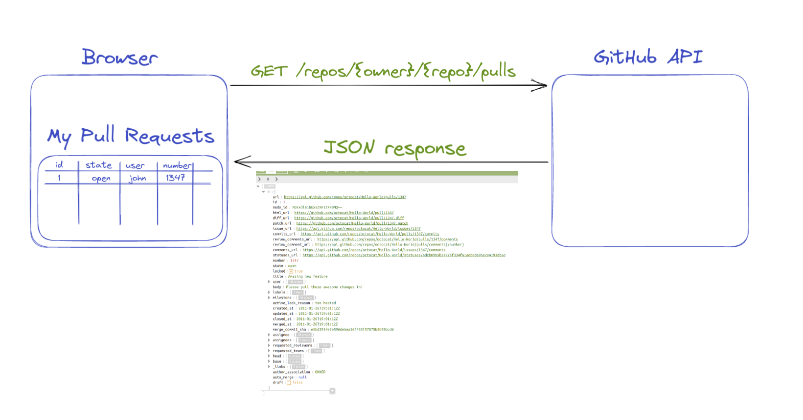
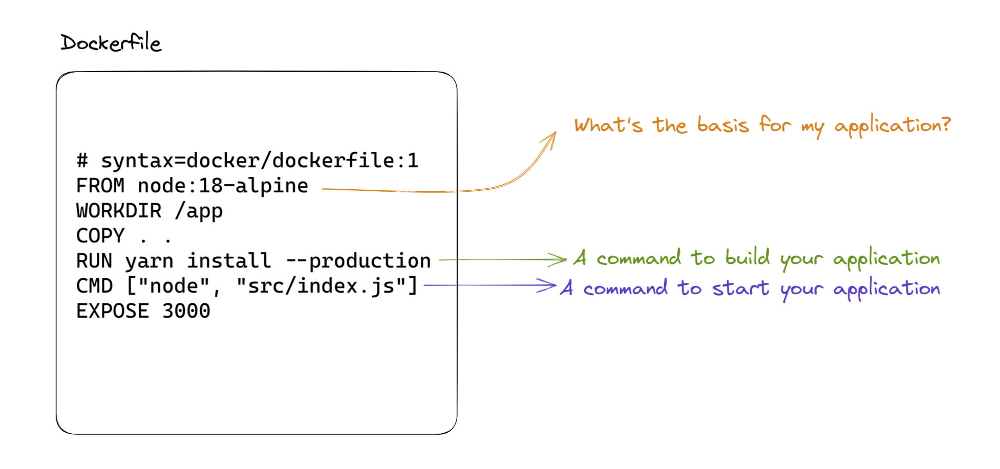
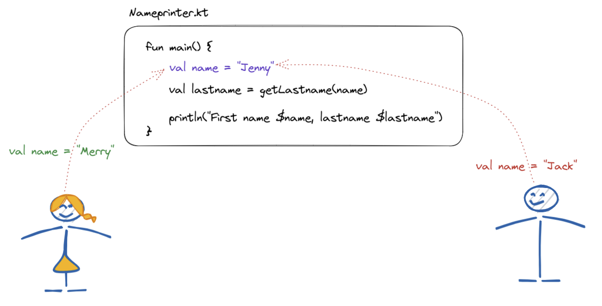
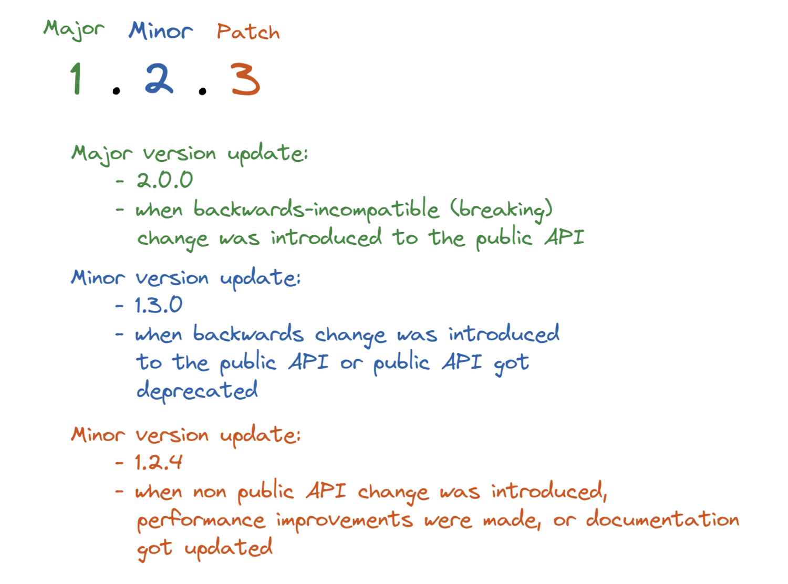
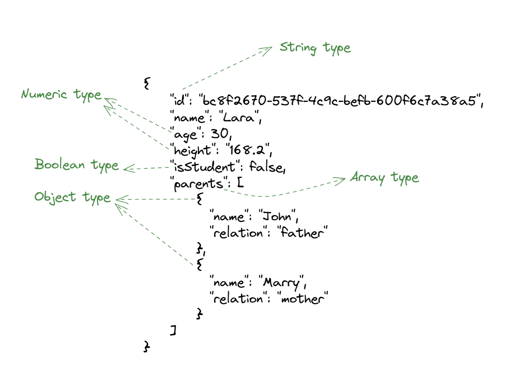
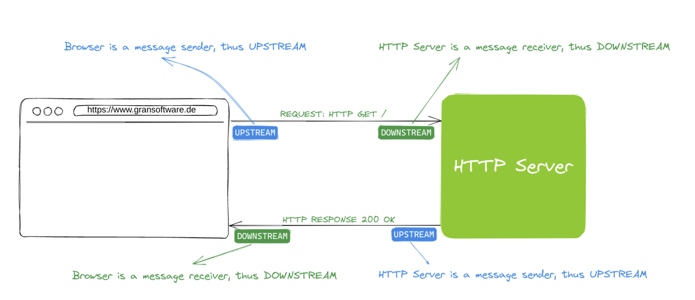
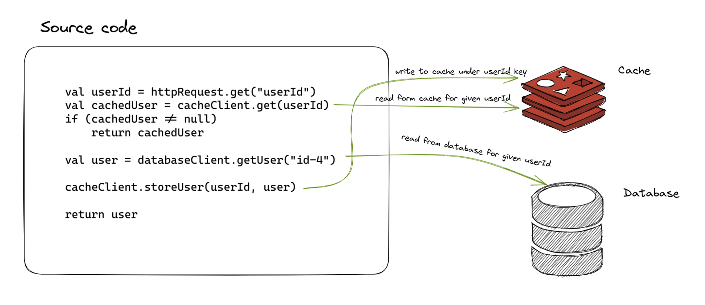

You just started your software developer career and day-by-day you hear new terms, such as **Docker**, **API**, **abstraction**, etc. Your more experienced colleagues are handling that with ease, but you feel left out,
constantly running behind. Maybe even being embarrassed to ask. That’s exactly what this blog post is about - we will give you concrete examples of some frequently used terms, presented in an easy-to-understand manner.

So, without further ado, let's get started with the examples.

<!--truncate-->

## API



Building applications on top of existing APIs

Stands for **A**pplication **P**rogramming **I**nterface. Interface being a point where two systems, subjects, organizations, etc. meet and interact. API in simple terms means any kind of utility that can be
consumed by other applications.

You may come up with an idea to build an alternative UI for managing GitHub Pull Requests to the one provided by github.com. To achieve that, you can integrate with the pull requests API from GitHub, and present the
data coming from this API.

Another example may be building a command line utility, where you want to find the biggest file on your computer, where you need to interact with the File-system API to get this information.

Most of modern Web applications are designed so, that a Front-end application (say ReactJS) is connected to a backend API, to get or update / delete some data.

## Docker containers



A technology which can be installed on any modern Operating System with a purpose of packaging your entire applications for easier usability.

In order to package your application as a Docker container, you need to supply a file describing how to install all the dependencies that your application has, as well as the command that
needs to be executed to get you application up and running.

Once this file (most often named `Dockerfile`) is prepared, docker tool allows you to build an image of your application, which can be then pushed into many image registries out there
(i.e. https://hub.docker.com/, Amazon Container Registry, etc)

After the image has been pushed to a registry of your choice, anyone that has an access to the image repository can run your application.
Without containerization technology, you would have to worry about all the challenges when installing and running software on many operating systems.

## Version control / Git

Version control refers to the ability to control the versions of the digital artifacts, whatever it may be (e-books, word docs, mp3 files...).

In the software development sense, we're talking about the ability to manage versions of our software, as we change it.

Version control systems do not need to be exclusively used for code management: we can use it to version our images, word documents or any kind of digital artifact.

The advantage of versioning is the ability to track the progress of some software product, but also by versioning we have a chance to easily jump from version to version and that
may come handy in case we introduce a bug in version `1.4.2`, but luckily we know that a version `1.4.1` worked just fine.

Git is a cross-platform software which technically enables us to manage software changes, by creating new versions. Git is not the only technology that can be used for
versioning your software, but has become kind of industry standard, due to it’s flexibility, speed and it’s distributed model.

Git as the software is what behind the scene powers services, such as GitHub.

## Open-Source

Every piece of software is based on some source-code that was written for it to be able to execute. There are 2 kinds of the source-code:

### Closed-source

Examples of these would be Windows Operating System code-base, MacOS one, etc. Closed-source is mostly developed by the companies which do not want to publish their source-code,
because the code is their competitive advantage, and brings them financial income.

### Open-source

The opposite side, which promotes values of public visibility of the code, so that everyone can access and view it. An additional step is an ability for everyone to change the code.
This lead to the enormous popularity of public tools, such as GitHub, which provide an easy way for people to collaborate on software projects as well as to share code from each other.

## Merge / Pull requests

Pull requests is a formal process of contributing to the existing code-base. It helps ensuring that any code change that needs to be made, gets verified by experienced engineers.
The process looks something like this:

* There is an existing software code-base
* **User A** wants to extend existing functionality / fix existing bug
* (S)he **prepares a bugfix or a feature** on own development machine
* There is a **User B** who is considered a project maintainer (the one who knows the project well and ensures its quality)
* **User A** informs **User B** that (s)he wants the new feature/bugfix integrated integrated into existing code-base, which is a formal process (most often) performed using Web UIs provided
by the source-code hosting platform, e.g Github, Gitlab, BitBucket, etc, where the code is hosted.
* The pull request then usually goes through a **series of improvements**, until it’s ready to be merged
* After being merged, the new feature or bugfix is successfully integrated into the code-base

## Merge conflicts

Working in a collaborative environment sometimes lead to a situation when two team members want to change the same line(s) of code, for different reasons. Let’s illustrate the problem



Merge conflicts happen in the situation where there’s an existing code base (Nameprinter.kt in this example), and there are two developers, which **want to update the same line(s) of code**.
In the case from the image above we have a name variable defined, in the current file version, and we have two attempts to change it: the one to make it hold ”Merry” and the other one to hold ”Jack” value.

So, the two developers happily commit code in their local repositories,  and want to push their code to the main branch, which contains tested and stable code.
The first developer that wants to merge her changes into the main branch will have no issues with this at all. Let’s say that `val name = "Merry"` is what we now have in the main branch.
But, what happens when the second developer wants to push her change to the repo? Well, let’s say we’re using Git Version Control. With an attempt to push the change from the second developer, Git will report that the second developer is running slightly behind the server, and that the changes on the server need to be pulled locally, and then the second developer can push to code to the main branch.

At this moment the **merge conflict** will occur, giving a clear signal to the second developer that she **needs to decide** what should be the content of the problematic line. The second developer **most often**
needs to discuss with the person that contributed to the conflicting line, to find the adequate solution. Once there’s a solution agreed upon, the second developer can **resolve the merge conflict** and push her
changes to the central repository.

## Synchronous / asynchronous execution

Synchronous might be more easily understood if we use term blocking instead. Some things need to be synchronous/blocking by their nature. Imagine you have a sample code:

```kotlin
function completeCheckout() {
    storeOrderInDb(); // takes 2s
    transferToOrderManagementSystem(); // takes 3s
    sendConfirmationMail(); // takes 3s
}
```

Ideally, we should not design our systems to be synchronous / blocking. If, in the example from above, we decide that all 3 functions `storeOrderInDb`, `transferToOrderManagementSystem` and `sendConfirmationMail`
are synchronous, than user will have to wait 8 seconds in total until he gets a response from the server.

If you, instead, decide that only the first method, storeOrderInDb is synchronous, and other 2 aren't, that means that user will have to wait only 2 seconds, until his order is successfully stored in the database,
and his order will eventually be sent to order management system and he will get a confirmation e-mail (this can wait a bit, and the user doesn't need to get this done immediately).

A good rule of thumb would be that we should design for asynchronous, and the user should not be blocked unless there is a valid reason to do it.

## Software versioning



Software evolves over time.

It gets bugs fixed and new features added, as well. It can be that, for whatever reason, some user wants to use the first version of our application, two years old, whereas some other user wants to use the latest one.
We need a way to store our updated software alongside its version somehow.

There are a couple of versioning schemas, <u>[Semantic versioning](https://semver.org/)</u> being one of them with high adoption.

One additional reason to have versioning schema in place is an easier way to roll back some software that contains a bug for example, to a previous, known to work version. So, if we have rolled application version
`1.2.3`, and we want to roll it back, we could simply, from our software registry pull the version `1.2.2` and roll it out to the customers.

## Logging

When developing our applications (mostly backend systems), it's very important that during the application runtime execution we preserve some sort of messages containing important information about a system or user behavior.

An example would be that if a user enters 3 times wrong login credentials we store this message so that we can troubleshoot/diagnose given use-case. The recommended way of doing it would be writing these messages to the
standard out (console), which can later be searched through when needed.

Another case would be that in case our code talks to the database, and there's a connectivity issue, we could store the message, something along the lines: "There was a connection timeout connecting to the database x.y.z".

Often, these logging libraries contain various logging levels, such as `DEBUG`, `INFO`, `FATAL` which help us set the importance of the things we are logging: we can then, for instance, filter logs which are considered
`FATAL` and then do the analysis and the troubleshooting.

Often you want to enable `DEBUG` level logging on your dev environment, so that you can additionally assert if everything runs as expected, and use `WARN`/`FATAL` level on your production, to avoid noise, and see only
issues in the runtime.

## JSON

JSON is a human-readable and a portable data serialization format . It's famous for being used for a data interchange between browsers and servers, but not exclusive to that.

An example of JSON serialized (formatted) data would be:



JSON provides a couple of data types, such as strings, numbers, objects, arrays, and all of them together are enough to express any sort of data, which is one of the reasons
why it's heavily used (apart from human readability).

## Request / Response

Very popular interaction model between two (software) parties, where one side (client) initiates the communication by sending **a request** to the other party (server) which upon
understanding and processing the request sends **a response** back to the client. Very often you’ll hear HTTP Request / HTTP Response which is a specialized case where such
communication going over the network, using HTTP protocol.

## Scalability

A frequently used term is software scalability, which is an ability of the software to cope with the ever-increasing load, often as consequence of an increased number of users using
the software at the same time. Applications should be designed in such a way to be able to handle the increased load in a reasonable manner, by responding to the user in as short
amount of time as possible, or, when not possible, informing the user that the system is experiencing high load, and that the requests can’t be fulfilled.

## Abstraction

You will very frequently come across this term, as you progress in your career. Abstraction is a fancy name for hiding some complexity under some name. What does that mean?

Suppose we have a function:

```kotlin
const getUserDetails = (userId) => {
const baseUserData = await http.get("https://api.users.com/users/${userId}")
    .header('Accept', 'application/json')
    .header('X-API-KEY', 'xxxx-yyyy')
    .call();
const dbRow = dbClient.connect('my-database').executeQuery(
    "select * from users where user_id = ${userId}").first();
	return {
		...baseUserData,
		...dbRow
	};
}
```

This method, as you may guess by being patient enough to read it entirely combines user data originating from two datasources: HTTP API and a database. This imposes non-trivial cognitive load
on the reader, which we may reduce by introducing abstractions named `getDatabaseDetails` and `getBaseUserData` :

```js
const getUserDetails = (userId) => {
    const baseUserData = getBaseUserData(userId);
    const dbRow = getDatabaseDetails(userId)
    return {...baseUserData, ...dbRow};
}

const getBaseUserData = (userId) => {
    const baseUserData = await http.get("https://api.users.com/users/${userId}")
        .header('Accept', 'application/json')
        .header('X-API-KEY', 'xxxx-yyyy')
        .call();
}

const getDatabaseDetails = (userId) => {
    dbClient.connect('my-database', 'my-username', 'my-password').executeQuery(
        "select * from users where user_id = ${userId}"
    ).first();
}
```
Here, we reduced the cognitive load to the user by hiding all the lower-level details under two abstractions `getBaseUserData` and `getDatabaseDetails`. The immediate advantage is that getting to know what `getUserDetails`
function does is no longer such a complex task. Another advantage is that two newly created abstractions can even be reused in some other place in our applications where this behavior is needed.

This is just a short intro to abstractions, which is something you will likely master throughout your career.

## Upstream / downstream

You will hear these two terms relatively often: **upstream server - downstream server**.

Or **upstream job - downstream job**.

I was having difficulties with this one until I came across the article that simplified this one for me:

> Upstream is a **message sender**. Downstream is a **message receiver**

Imagine you have an HTTP client and an HTTP server.

HTTP client issues a request to a server to save some user data:

```http
POST /user
Host: myserver.com
Content-Type: application/json

{
"name": "john",
"age": 33
}
```

Looking from the perspective of the HTTP request, **the client** is an **upstream component**, being a message sender, and **the server** is a **downstream** component,
being a message receiver.

Upon user being saved successfully, **http server** replies:

```http
200 OK

{
"userId": 222
}
```

From the perspective of the the HTTP response, now the **http server** is an **upstream** component, being a message sender, and **http client** is a **downstream** component, being a message receiver.

Hope that additional illustration below makes things clearer.



## Database

We use databases when we want to have some long term accessible data. There are many database solutions out there, optimized for particular use-cases.

Databases ensure that the data we put there stays there as long as they are needed. Often, these databases ensure that the data persisted is also backed up, to ensure there's no data loss.

Apart from the ability to store the data, the databases provide a way to query the data and access it.

Two very popular types of databases nowadays are relational and document databases. The have different use-cases when one should use them, and some examples of concrete technologies implementing these types are PostgreSQL on a relational side, or MongoDB on the relation side.

Associated with databases is the so-called CRUD acronym. It refers to Create, Read, Update and Delete, that are the actions we can perform over database entries.

## HTTP

Means for reliable exchange of text-based, human and machine-readable content between different applications.

The core of HTTP communication is the client/server and request/response pairs. The communication goes like:

HTTP client application (say, your browser) sends a HTTP Request to a remote HTTP server

HTTP Server receives the request, and responds with a HTTP response, which then client handles in some way.

An example of the HTTP communication would be the one between a browser and a server needed to fetch resources for rendering web page: html documents, css styles, JavaScrtipt scripts, Ajax requests, etc.

HTTP contains a server host name, request and response headers, depending on use-case request and / or response body, cookies etc.

HTTP supports the concept of verbs, such as `GET`, `POST`, `DELETE` which provides a way to express more clearly what do try to do with the remote resource, like getting some resource, deleting it, and so on.

## Rest API

Rest API is layer sitting on top of aforementioned HTTP protocol, and is based on the concept of resources.

Rest API, like any other API, is used to build applications by integrating with them. In this case, integration is done using an HTTP client.

Many popular platforms today, like Facebook, Twitter or Github provide their APIs, which they use themselves (e.g. Facebook website or their Android and IOS mobile applications are consuming Facebook API itself), but also to be consumed by the others (above some limit you get charged for it).

As mentioned, resources are a central concept in the Rest API world. One resource can be (let's use Github API as an example) a repository, and Github API states that we can manage particular repository via their APIs, by accessing particular URLs and sending correct input data using proper HTTP verbs.

Apart from Rest APIs, there are also emerging GraphQL APIs, which are also sitting on top of HTTP protocols but differ in philosophy of how the data should be accessed and managed.

## IDE

Stands for Integrated Development Environment, which is a piece of software used to develop applications. Some popular ones: Visual studio code, IntelliJ IDEA, etc.

IDEs differ from classical text editors by offering way richer set of refactorings, and way deeper awareness of the frameworks and programming languages. That way they help you write better code.

## Agile development

Agile development refers to the way the work is organized nowadays when developing software. This is more like general idea, and there are couple of concrete methodologies adhering to these principles, such as: Scrum, Kanban, etc.

The idea is that software should be changed frequently, in small increments, so that each increment can be validated by the user as soon as possible.

By being able to frequently release smaller software increments, we can get the feedback from the users, but also we are able to more easily recover from the bugs we may have introduced (since the scope of small changes allows for easier troubleshooting).

You may also hear about tools such as Jira, Azure DevOps or ClickUp, which help simplifying your software development flow.

## Testing

Testing is the formal process of asserting software quality. Ideally, we want to test the things ourselves, before we hand our software to our customers. In general, we have two types of tests:

### Manual

Manual testing involves 1 or more people testing applications by hand, by interacting with, for instance, a mobile application, or browser-based websites, by going through a series of scenarios (use-cases) and asserting that what was expected happened. This testing category is very expensive, and error-prone on top (anything involving people is risky), so it should be minimized.

### Automated

This group of tests should be the desired way to test the software before releasing it. The idea is to write a set of tests that can be executed by machines, thus they will be much faster and less risky than when performed by people.

One test, implemented in some programming language (let's say Python), interacts with our software, gets the results of that interaction, and asserts that results match expectations of such an interaction.

These automated tests can further be divided in **unit tests**, **integration tests** (there's no consensus on what types of tests should exist and how should they be named at the time being)

:::tip
One important thing to note is that testing reveals presence of bugs, not their absence. The fact that your tests are green most likely conveys the message that you didn’t test enough
:::

## Debugging

Debugging is most often used in those cases when we want to troubleshoot some issues we have with our application. Technically speaking, debugging is a mode in which we can start the application so that we can inspect its behavior during the execution. There is also a concept of breakpoints, which are the points in code (concrete lines in source files) where we would like to pause application execution.

How it works:

* Set a breakpoint in a source file's concrete line you'd like to pause your application's execution

* Trigger an application flow that would cause the line you set to be executed

* When the execution reaches your line, it will pause there, giving you control to:

    * resume it

    * inspect all the variables (global, local)

    * continue debugging line by line

    * step into functions...

This is mostly used by developers on their machines, but sometimes it's also possible to debug processes running on remote machines.

## Compiling

There are programming languages, such as JavaScript for instance, where a JavaScript engine can directly execute the lines of code you wrote. This is for instance your browser, or a NodeJS.

On the other hand, many programming languages (such as Java or C#) require us to create an intermediary representation of code, which is both required and optimized for the runtime and is the representation that is required to run the applications written in these languages.

For instance, in case of Java programming language, we need to transform Java source code files into Java bytecode files. These are later used to run our application using Java runtime environment.

Pre-compiled code representations tend to be highly optimized for the platform which executes the code, leading to greater security and performance.

## Client / Server

This is one interaction model (out of a few ones) between the two software parties (processes) where:

client is a party which **initiates communication** with the server

server is the party which **responds to the requests** sent by the client

This interaction model you can find, for instance, in web browsers, where the client (the browser itself) requests web resources from the web-server (which is server in this case)

Servers never initiate this interaction.

## Deployment

Deployment is a process of installing your software on a server, making it available for end-users. Deployment frequency and duration can vary significantly between different applications, depending on software complexity, a technical debt of the applications, deployment tooling efficiency, etc.

There are companies which are deploying their software several times a day, whereas some companies deploy very rarely, once in a month, or even less often.

The deployment should, ideally, be an automated process, consisting of various testing phases, packaging and versioning software release, installing it on a server, and performing some health checks to ensure the success of the deployment

## Caching



Caching is a process of remembering values of some time-taking or resource expensive computations so that they can be reused for the subsequent, identical calls.

In some systems, querying a database is a very expensive operation time-wise, and we might want to cache some results that can be cached.

For instance, imagine we have an e-commerce platform, and we want to present categories to the users, which are coming from a database. These categories are not changing so frequently, so we might want to protect our database server being querying each time each page is displayed for each user by caching these results once they are returned from the database the first time.

We often store this cached value in server memory, or we can put this information to the external tools, such as Redis or similar, which have much better read performance than the databases.

## Conclusion

It's not easy to start a career as a software engineer. We simply need to be familiar with too many concepts. In this post, we've covered a few of the most popular ones in a way that will give you enough background information to participate in conversations with your more experienced coworkers.

Do you want any further software development jargon that I missed to be defined as well? Please let me know by clicking the button below.

Please forward this link to any friends or coworkers who might find it useful.

