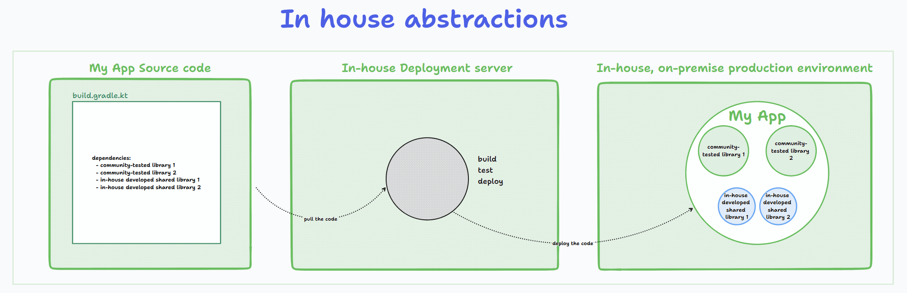
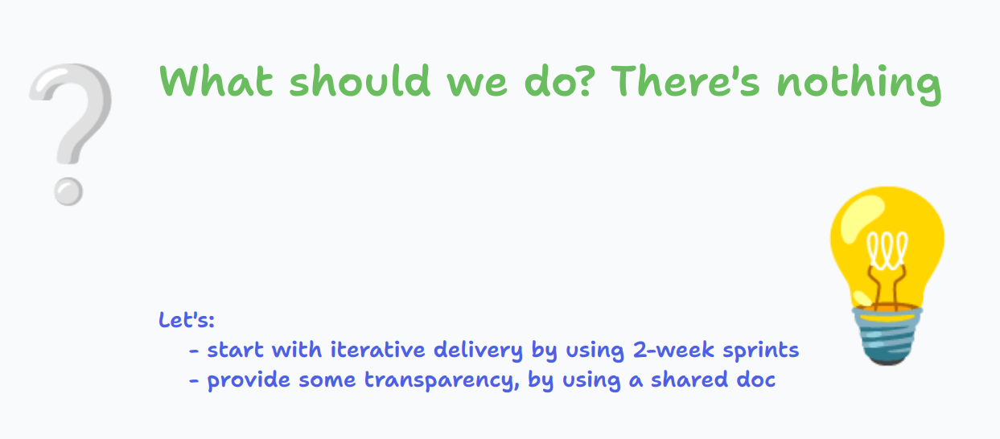
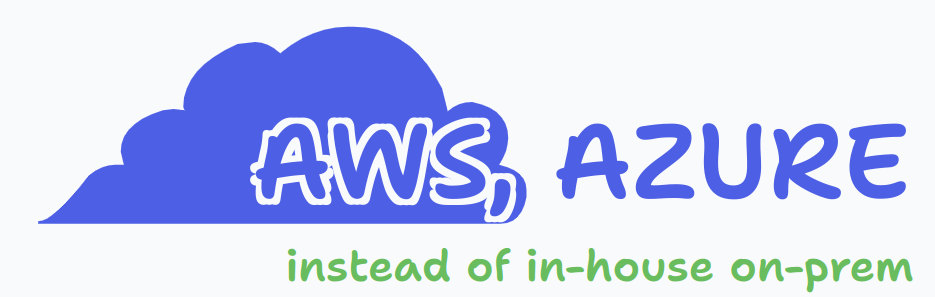
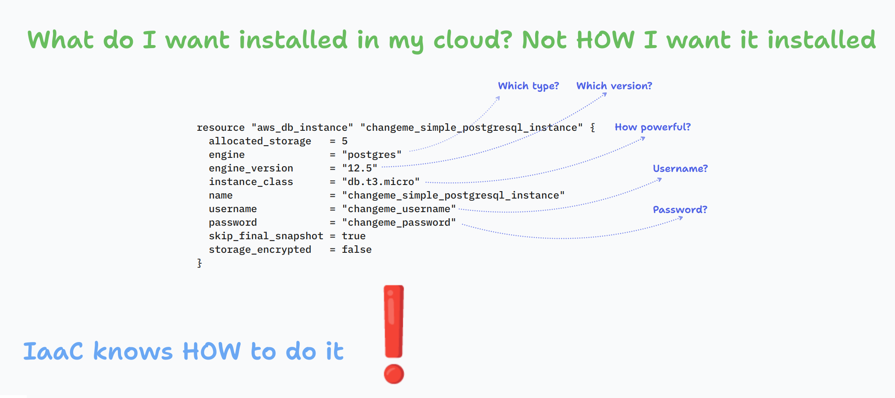

# Yes, companies in the automobile industry can (and should) undergo a digital transformation

I am excited to share that I was part of a successful digital transformation project in the automotive industry.
This project involved implementing new technologies and processes to streamline operations and improve overall efficiency.
<!--truncate-->
The results were impressive, with significant cost savings and increased productivity. By sharing own experience and knowledge in this blog post, you can gain valuable insights on how to apply similar strategies in your own industries and achieve similar success in you own digital transformation initiatives.

Whether you're in automotive or any other field, the principles and approach can be adapted to fit your particular case.

## What were the challenges we were facing?

There was an initial understanding of what had to be done.

It's common for businesses to have a general idea of the software product they want to develop, but not all the details worked out yet. This is completely normal and expected. In fact, it's often better to start with a "half-baked" idea and let it evolve and take shape during the development process.

The development process can act as a discovery phase where the idea is shaped, features are added or removed, and the final product is refined to meet the specific needs of the business and its customers. This allows for a more flexible approach and the ability to adapt to changing market conditions or customer feedback. It's important to remember that the software development process is iterative, and the idea will likely evolve and change over time. Businesses should be open to this process and be prepared to adjust their original vision as needed. This approach ultimately leads to a more polished and successful end product.

Approximately in June 2021, when there was only a broad knowledge of what needed to be done, I joined the project. The project began with the following team in place: I had a senior backend engineer role, another senior devops consultant was already on the team when I joined, and representing the client was a product owner.

Let's delve deeper into the challenges we faced once the project began.

## Integration with an inexperienced internal engineering team

Collaborating with an engineering team that lacked experience building modern software systems presented a number of difficulties. One major issue was that the team was unfamiliar with the latest development methodologies, tools, and technologies. This lead to delays and inefficiencies in the development process, as well as a lack of scalability and maintainability in the final product.

Another challenge was that the team lacked the necessary skills to design and implement complex systems. This can result in poor system architecture, which leads to issues with performance, security, and reliability. Additionally, the team didn’t have any experience troubleshooting and debugging problems that arise during development, which can further slow down the process.

To mitigate these difficulties, it was necessary to provide additional training and support to the team (often in the form of pair programming, collaborative coding sessions, etc.), as well as to establish clear communication and collaboration processes. My role on the project was exactly that - to provide guidance and mentorship to the team.

## Absence of any project management techiques / tooling

Project management is an essential part of software development. It involves planning, organizing, and overseeing the development process to ensure that the project is completed on time, within budget, and to the satisfaction of the stakeholders. Without proper project management methodologies and tools, software development projects can suffer from a variety of negative impacts.

What are the risks of not having any project management strategy when joining a project?

One of the most significant negative impacts of not having project management methodologies and tools is **poor communication**. Without these tools, it can be difficult to keep track of project progress, assign tasks, and communicate with team members. This can lead to **delays, misunderstandings, and confusion**.

Another negative impact is the **lack of organization**. Without project management methodologies and tools, it can be difficult to **keep track of project timelines, budgets, and resources**. This can lead to **delays, cost overruns, and a lack of accountability**.

In addition, without project management methodologies and tools, it can be difficult **to identify and manage risks**. This can lead to unexpected issues and delays, and can also lead to higher costs.

Finally, without project management methodologies and tools, it can be difficult to ensure that the project is meeting the needs of the stakeholders. This can lead to **dissatisfaction** and, ultimately, **the failure of the project**.

## No consensus about the way of working and common core values

When a team is working on a software development project, it's important for everyone to be on the same page about how the work will be done and what values are important to the team. Without consensus, things can quickly become chaotic and inefficient.

One of the biggest problems with not having a consensus is that team members may have different ideas about how the work should be done. This can lead to confusion and delays as team members try to figure out what they are supposed to be doing. It can also lead to frustration as team members feel that their ideas are not being heard or respected.

Another problem with not having a consensus is that team members may have different ideas about what is important in the project. This can lead to unmet expectations as team members may feel that their priorities are not being considered. It can also lead to disappointment, as team members may feel that the project is not meeting their expectations.

Finally, not having a consensus can lead to decreased satisfaction among team members. When team members feel that their ideas and values are not being respected, they may become disengaged and demotivated. This can lead to a lack of commitment to the project and a decrease in overall team performance.

## Cumbersome tooling available

Inadequate tooling can have a significant impact on software development speed and communication effectiveness. When tools like self-hosted Rocket Chat or Jira (which were a must-have) are unstable or offline, it can disrupt the flow of work and impede collaboration among team members. Developers may be unable to access important information or communicate with their colleagues, leading to delays and confusion. Additionally, when tooling is unreliable, it can erode trust and morale among team members, further hampering productivity.

To ensure that software development is efficient and effective, it's essential to have robust and reliable tools in place that can support the needs of the team. This may include using cloud-based solutions or outsourcing the hosting and maintenance of these tools to a third-party provider.

## Not invented here syndrome

Following "not invented here" practices can lead to less effective processes, higher maintenance costs, and opportunity costs. These practices involve rejecting or avoiding ideas or solutions that were developed externally, instead opting to develop similar solutions internally.

Internal solutions may require significant resources to maintain and update, leading to higher costs over time.

At the start of the project, I suggested that we switch from our self-hosted Rocket Chat tool to Slack or a similar program, and abandon our slow, problematic self-hosted Jira installation; this suggestion was not well received by the team.

## Getting access / credentials for anything takes from weeks to months

Bureaucratic processes can have a significant negative impact on software development teams.

These processes often require extensive (and often outdated) documentation to be read and understood, creating confusion and delays. Additionally, navigating the complex hierarchy of approval and authorization needed to gain access to resources can be time-consuming and frustrating.

Lastly, bureaucratic processes can limit the ability to quickly access necessary documentation for troubleshooting purposes, leading to additional costs and delays.

## Lack of transparency - no estimations for work needed to be done

The team was struggling with a lack of transparency. They were not properly estimating project tasks, which led to delayed deliveries and a high number of tasks that were simply too big to be carried to completion. This resulted in extra-long delivery times and a lot of frustration for team members.

The team's lack of transparency was causing a lot of problems. They were not communicating effectively with each other or with their stakeholders, and as a result, they were not able to deliver projects on time. They were also not able to manage their workload effectively, which led to a lot of stress and burnout among team members.

In order to solve this problem, the team needed to start estimating project tasks more accurately. They also needed to start communicating more effectively with each other and with their stakeholders. This would help them better manage their workload and deliver projects on time.

To do this, the team decided to start using a project management tool that would help us estimate project tasks more accurately. We also decided to start holding regular team meetings to discuss progress and make sure everyone was on the same page.

## Bringing more and more people to solve quality issues with quantity approach

The software development team was in trouble.  Despite being composed of skilled and experienced engineers, we were struggling to deliver projects on time and within budget. The root cause of this problem was a lack of effective and transparent processes.

The team had no clear guidelines for how to approach a project, and there was a lack of communication between team members. This resulted in confusion and delays, as team members were not sure what was expected of them. Additionally, there was a lack of accountability, as team members were not held responsible for their actions.

In an effort to fix this problem, the company decided to bring in more external people to the project. They believed that these new team members would bring fresh perspectives and new ideas to the table. However, this decision only made things worse.

The new team members had to spend a significant amount of time getting up to speed on the project. They had to learn about the company's processes, the existing codebase, and the project's requirements. This ramp-up time slowed down the project even more, as the new team members were not able to contribute to the project right away.

The team's lack of effective and transparent processes also made it difficult for the new team members to understand what was happening on the project. They were not sure who to go to for help, and they were not sure how to communicate with the rest of the team.

## Enforce using immature in-house developed abstractions

In-house abstractions are a common (anti)pattern

When a large company enforces internal software development teams to use software abstractions that hide complexities of the Cloud configuration, or enforce using in-house unstable and low-quality shared libraries, it can have negative effects on the delivery time and product quality.

This can lead to delays in delivery and lower satisfaction among the development team. Additionally, the use of abstractions can make it more difficult for developers to understand and troubleshoot issues, leading to increased frustration and a decrease in productivity.

Furthermore, using in-house shared libraries of low-quality can result in bugs and errors that can be difficult to fix, further delaying delivery and lowering product quality.

## The actions we took to improve the situation

As you can see, there were a number of concerns that needed to be addressed. I then sat down with the rest of the team to discuss our current situation and our future course of action. How can we handle each of these concerns? The list of specific steps we took to advance the project is below.

### Evolution instead of revolution

Performing a major transformation within the automotive industry can be a challenging task, but it is essential to plan for evolution rather than revolution. A compact approach that focuses on gradual changes will be more effective in achieving the desired outcome.

When transforming a company, it's important to keep in mind that there may be resistance to changes from employees and stakeholders. This can be due to a lack of willingness to change the status quo or a fear of the unknown. It's crucial to address these concerns and work towards building a shared vision for the future.

One way to approach this is by involving employees and stakeholders in the planning process. This allows them to feel a sense of ownership and commitment to the changes that are being made. It's also important to communicate the benefits of the transformation clearly and consistently. This will help to build buy-in and support for the changes that are being made.

### Using project management tooling: JIRA, Azure DEVOPS

At the very start, since there wasn’t anything to kick the project off, we operated without any plan or organization. The product owner had a rough idea that needed to be worked on, and that was all there was.

First, we organized the work in an iterative manner, by deciding to follow Scrum methodology. We decided to have two-week sprints. We still didn’t have any tools at hand, so we started with a shared document. We wrote some task titles, and next to them, we wrote the names of developers who would like to tackle them. This was the way we did things in the first sprint.

After a while, which was to be expected, such a rudimentary process became a bottleneck, so we decided that we should start using self-hosted Jira (provided by the client), which helped increase the transparency of what we do.

This has already helped tremendously. As this tool was self-hosted, it suffered stability issues, so we went for a similar tool, Azure DevOps, which has been very stable since then, and it’s still being used on the project.

We experienced the following benefits by using these project management tools:

Improved collaboration: These tools allow team members to work together more effectively, by providing a centralized location for project information and communication.

Increased visibility: With project management tooling, it is easier to keep track of project progress, identify issues, and make adjustments as needed. This can help teams to stay on schedule and deliver projects on time.

Better organization: Project management tooling can help teams to better organize tasks, assign responsibilities, and manage resources. This can improve efficiency and reduce the risk of errors.

Enhanced reporting: These tools typically provide detailed reporting and analytics, which can be used to gain insights into project performance and make data-driven decisions.

Improved communication: With project management tooling, it is easier to keep stakeholders informed about project progress and status. This can help to build trust and improve the working relationship between different teams and departments.

Streamlined workflows: These tools can help to automate repetitive tasks and streamline workflows, making it easier to manage projects and free up team members to focus on more important work.

### Using own AWS / Azure subscriptions, rather then a client-provided on premise solution

At the start of the project, our team was offered that some other team at the client site manages our infrastructure for us. This was a on-premise solution. This, clearly, could sound reasonable - that someone else volunteers to take part of your problem on themselves - but this was something we didn’t want to happen for a couple of reasons:

More often than not, in-house teams do not have such level of technical expertise compared to engineering force at Microsoft, Google, etc.

It’s not a rare case that the documentation doesn’t exist, or it’s very poor

Major cloud vendors are faster with integrating tools, such as for instance Kubernetes, than the in-house teams.

Solutions offered by in-house teams have been tested on a much smaller number of customers, so the quality of services offered is significantly lower then the ones provided by major cloud providers.

We went for the Azure cloud, which offers many advantages over an on-premise, self-managed solution. Most notably, the ability to scale quickly and elastically as your business needs change. With Azure, you can quickly deploy virtual machines and other services on demand with a few clicks of a button and only pay for what you use. Additionally, since all the infrastructure is managed in the cloud, you don’t have to worry about server maintenance or patching of software updates which can eat up valuable time and resources. Finally, Microsoft provides a wide range of services that are tailored to meet any need, from big data analytics to content delivery networks, along with access to their global network of data centers, ensuring high availability for mission-critical workloads.

### From nothing, via self-hosted GitLab to GitHub

The project kicked off with no place where our source-code could be stored. Our external DevOps consultant proposed that we start with self-hosting a GitLab instance. This allows us to have the flexibility of configuring it to fit our needs. We began using the system and were generally content with it, however, we encountered some occasional interruptions in service. This forced us to think about a more stable solution that could boost our productivity.

After talking within our team, I came up with proposal to give GitHub and GitHub Actions a try. It became quickly evident that this was the best course of action to take.

It enabled us to collaborate on projects with team members located around the world. All code changes are tracked by Github, and it's easy to see exactly who changed what, when they made the change, and any comments that were left with the update. This helped ensure quality control is maintained at all times during development cycles. GitHub Actions helped our developers save time with repetitive tasks such as running tests or deploying builds.

### Full automation with IaaC, terraform and GitHub Actions

Some practices of our client, at the time I joined the project, were that the applications were quite often managed manually, which made us face the following challenges:

Reduced Visibility: As changes are made manually or using different tools, they can easily go unnoticed, which can cause unexpected issues or conflicts.

Manual Updates: Keeping systems up to date and maintaining a consistent configuration requires manual updates, which can be time consuming and prone to errors due to human error.

Security Vulnerabilities: Without automation and version control that Infrastructure as Code provides, outdated software and configurations put the system at risk of security vulnerabilities that could allow malicious actors access to the system and data it stores or processes.

Poor Scalability: When building systems without Infrastructure as Code, resources become more limited when you need them most - such as during times of increased user demand or when changing business needs demand a larger scale solution than you have currently in place.

The team went for Infrastructure as Code (IaaC), and the tool we used for it was Terraform, which helped us manage both of our clouds - the AWS one and the Azure one. We built pipelines that would validate any changes made to the infrastructure, and automatically deploy it to our environments using GitHub Actions, so we eliminated the need for someone to be in charge of doing this manually.

## Conclusion

As a conclusion, this blog post urges you to use cutting-edge software engineering techniques in areas that are technically stale. As a result, businesses will advance, and engineering teams will be happy.

If you know someone who could benefit from or be inspired by this article, show your support by sharing it with them!

