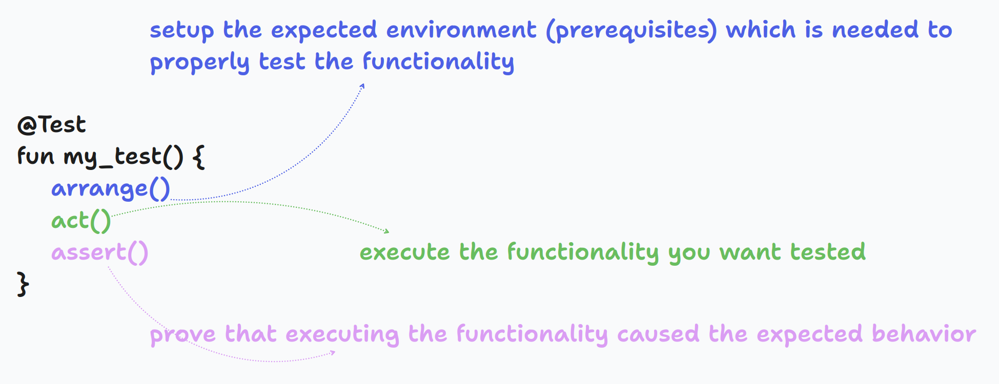
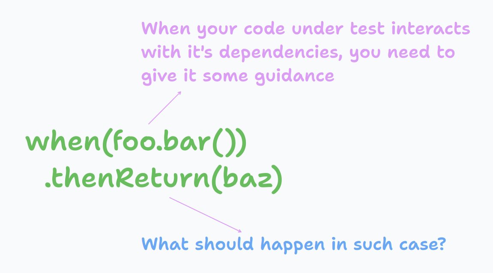

I'll give a brief overview of the concept of unit testing for those of you who are unfamiliar with the subject.

<!--truncate-->

Unit testing allows us to test code behavior **in isolation** so that we can **verify implementation correctness**. Unit tests, unlike some other tests, need to be able to execute very quickly, providing you with an almost instant answer to the question, "Does my code work as expected?” On top of that, they should be isolated from any external processes, like file-system access or calling databases or web services, during their execution.

## Anatomy of Unit tests

In general, we should plan our test method implementation to be divided into three parts, as shown below:



Let’s now explain each of these three phases.

## Arrange phase

In this phase we "emulate" execution environment of the code under test. What does that mean? Let's use a code snippet of the function we want to unit test:

```kotlin
class ProductService(
    val shippingCostService: ShippingCostService,
    val taxCalculationService: TaxCalculationService,
    val productPriceService: PriceService) {

    fun getPrice(productID: String): Long {
        val basePrice: Long = priceService.getPrice(productID)
        val shippingCosts: Long = shippingCostService.getShippingCosts(productID)
        val taxes: Long = taxCalculationService.calculateTax(productID)
        return basePrice + shippingCosts + taxes
   }
}
```

Here we have imaginary **ProductService** with **getPrice** method, which we'd like to test. Unfortunately - there are already some complications: this method can't be tested in isolation!
Why? Simply because our class depends on other classes to fulfill it's responsibility: `ShippingCostService`, `TaxCalculationService` and `PriceService`. We can call them **collaborators**.

Luckily, all modern programming languages support some kind of support for emulation (you can hear the term **“mocking”**) of our collaborators. Using these tools, we can give **instructions to our test engine to mimic their particular behavior (as per the instructions we provide) during test method execution**.



In our imaginary case - we could give such an instruction:

```kotlin
class TestClass {
    @Test
    fun getPrice_when_shipping_cost_service_returns_proper_number_returns_positive_number() {
        // arrange phase
        val productID = UUID.randomUUID().toString()
        when(priceService.getPrice(productID)).thenReturn(5L)
        ...
    }
}
```

## Act phase


In this phase, we actually execute the functionality under test. The example below shows how we execute the `getPrice` method of the `productService`.

```kotlin
class ProductServiceTest {
    @Test
    fun myTestMethod() {
        // act phase
        val calculatedPrice = productService.getPrice("XY-123")
        // assert phase
        ...
    }
}
```

Usually, after calling the function we're testing, we have to determine whether our function is correct or not. In our case,
the function **returns some value**, which we can inspect and **make a conclusion about whether the value is expected or not**. Also,
even in the case that the function we test returns no value, the **test context might have changed as a result of interaction**,
and we could inspect these context changes to verify our function's correctness.

## Assert phase


Now after the function we want to test got executed, we need to verify for correctness.

In this phase, we typically do the following things:

* verify return value from the function we tested, for instance:
  ```kotlin
  val calculatedPrice = productService.getPrice("XY-123")
  // verify starts here
  assertThat(calculatedPrice).isEqualTo(5)
    ```
* verify that we had proper interactions with our collaborators during our test execution, for instance:
  ```kotlin
  verify(taxCalculationService, times(1)).calculateTax(productID)
    ```

## Naming test methods

Consistency is key, someone said. Our brains feel more comfortable when they recognize patterns with ease. Let’s dissect the pattern I use when writing my test methods:


It consists of three parts, delimited by `_`:

* the first part is **the method name we test**

* the middle part is **the short description of the function execution context**

* the last portion describes **expected outcome**

Here are some more examples illustrating this:

```kotlin
@Test
fun getUserDetails_whenDatabaseDown_throwsException() {}
@Test
fun getNumberOfRegisteredUsers_whenNetworkError_returnsNull() {}
```

:::tip Key takeaways
* We need to know **what is the function we want to test** and more precisely, **which scenario** we are testing

* Each test method should be composed out of three code blocks - **Arrange**, **Act**, and **Assert**

  * **Arrange** - establish an environment needed to execute the test method
  * **Act** - invoke your test method
  * **Assert** - verify that the returned value from the method and/or the execution environment is in the state expected

* We should name our test methods so that it's enough to understand the test just be reading test method name
:::

## Conclusion

Writing automated unit tests is important. If you think you learned something new, feel free to spread the word by sharing this article to your friends