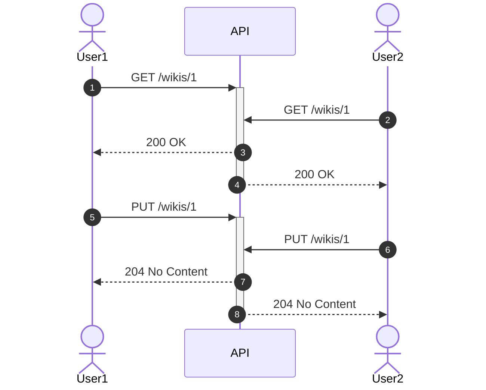
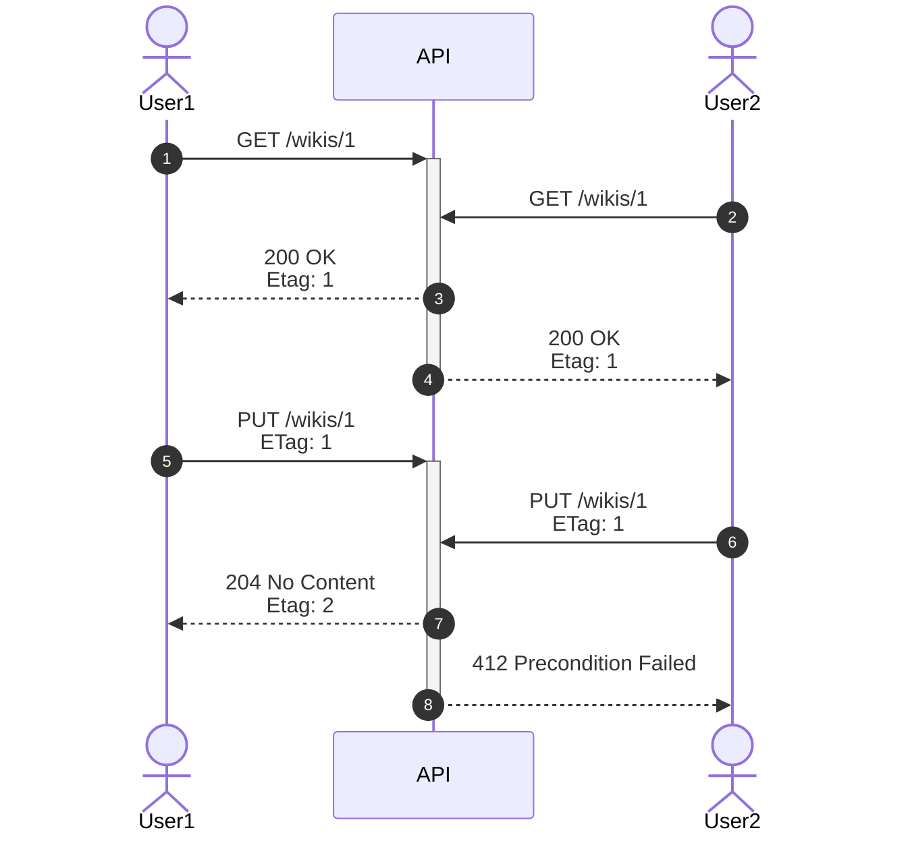
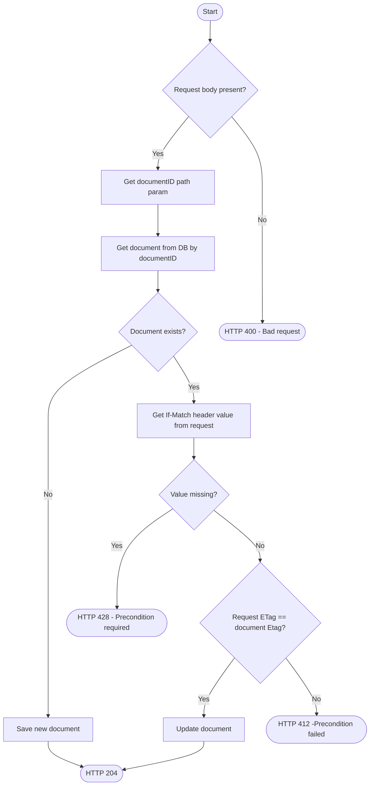
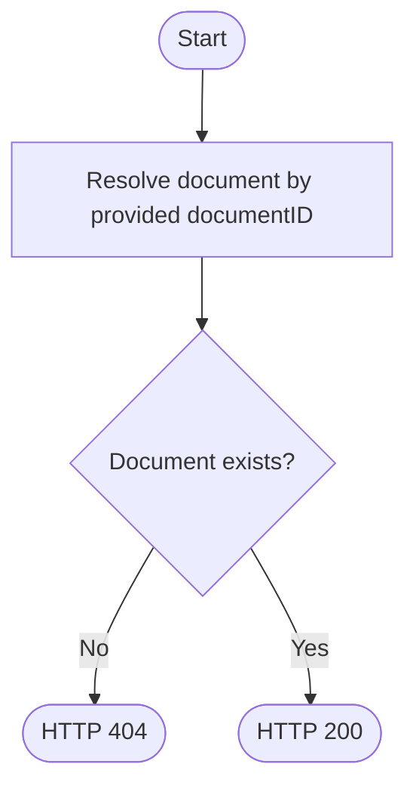

In this article, we will show you how to design and implement a REST API that can handle concurrent requests when updating the same resource.

We also provided <u>[a sample code](#sample-code)</u> which you can use to implement the described solution.

<!--truncate-->

## What's the problem to solve?

The issue we want to tackle is known as **"lost updates"**. When do such updates happen? When the same resources are attempted to be updated by multiple clients at the same time.
What happens in such cases, if you don't have any special handling? **The last update wins**.

Let's illustrate this with an example of two different users trying to update the same Wiki article:



As seen in the diagram, the issue is that the User2's update isn't based on the latest version of the document.

The solution is to make one of the two users (User2 in this case) angry :slightly_smiling_face:

## Optimistic locking - the solution to "lost updates"

The solution to this problem is called <u>["optimistic locking"](https://en.wikipedia.org/wiki/Optimistic_concurrency_control)</u>.
Simply put, it's an assumption that the transactions will not interfere often, and that there is no need to lock the resources. Instead, transactions are allowed to change
the data, but before they are committed, there is a check to see if the data has been changed in the meantime.
Non locking approach brings a performance benefit.

We will use a similar approach when designing our API.

Let's learn first about ETags, a mechanism to help us implement optimistic locking.

## What are ETags?

`ETag` is an <u>[HTTP response header](https://developer.mozilla.org/en-US/docs/Web/HTTP/Headers/ETag#avoiding_mid-air_collisions)</u>. The value of this header is an opaque
identifier assigned by servers to specific versions of resources. If the content changes, the ETag changes as well. ETag is used for caching purposes, as well as for concurrency
control. An example of an `ETag` header:

```http
GET /api/v1/documents/123 HTTP/1.1
Host: example.com
Accept: application/json

HTTP/1.1 200 OK
Content-Type: application/json
ETag: "bfc13a64729c4290ef5b2c2730249c88ca92d82d"

{
  "id": 123,
  "title": "My document",
  "content": "This is my document"
}
```


### Control concurrency with `If-Match` HTTP request header

`If-Match` <u>[request header](https://developer.mozilla.org/en-US/docs/Web/HTTP/Headers/If-Match)</u> makes the request conditional.

For unsafe methods, such as `PUT`, `POST`, `DELETE`, etc., the server will only proceed with handling the request if the ETag
matches the ETag of the resource on the server. Otherwise, the server will respond with `412 Precondition Failed` response. This addresses "lost updates" issue.

Let's illustrate this with an example:



## Real-world example

:::tip WIKI
Example with wikis: TODO
:::

If we have no special handling of concurrent requests, this leads to **"lost updates"** problem. This means that the later request overwrites the changes made by the earlier requests, making them "lost".

Let's demonstrate the problem of lost updates with an example. Let's, for a moment, pretend there's no such thing as Google Docs or similar collaborative editing tools.
Our boss comes to us and says:

> We need a tool that will allow group of people to **work together on a text document**. It needs to be finished in **2 days**.

With all the time in the world, we came up with the following design:

* This **will not be** a real-time collaboration where we can see the changes as they happen
* A user will only be able to update the document if the document is based on the **latest version of the document**

The business was happy with the design proposal, so we started implementing it.

### The user experience

After we finished the implementation, we tested it, by inviting 2 of our colleagues (Jeannie and Frank) to test it out.
The following is a timeline of Jeanie and Frank's actions and the results:


Our boss was happy with the results!

## Design & Implementation

To be able to achieve such user experience, we came up with the following API design:

* We will use **weak ETags** to handle concurrency
* We will need 2 API operations, one to **save** and one to **get** a document

### Saving a document

We designed saving a document so that it will use an idempotent `PUT` HTTP method. This method will be used to create a new document, as well as to update an existing one.
Clients are allowed to set the `documentId`.

The following is a sequence diagram of how the API operation was implemented:



:::tip
Requirements for this sequence are described in the [RFC 7232](https://www.rfc-editor.org/rfc/rfc7232#section-5)
:::

### Getting a document

Getting a document is far simpler. Using standard `GET` HTTP method, we will return the document with the provided `documentId`. If there's no document with the provided `documentId`,
we will return `404 Not Found`.

The following is a sequence diagram of how the API operation was implemented:



## Sample code

On our <u>[GitHub](https://github.com/gran-software-solutions/code-samples/tree/main/concurrency-in-rest-apis)</u> we've published a sample project that implements the described API.
The sample code is written in <u>[Kotlin](https://kotlinlang.org/)</u> using <u>[Vert.x](https://vertx.io/)</u> toolkit. It requires having <u>[JDK 11](https://adoptopenjdk.net/)</u> or newer installed

Here's how you can run it:

* Clone the repository
  ```shell
  git clone git@github.com:gran-software-solutions/code-samples.git
  ```
* Run the following command in the root of the project:
  ```shell
  cd concurrency-in-rest-apis
  ./gradlew run
  ```
* This will start the server on port `8888`
* Open another shell to run the commands to test the API
* Create a new document with id `7051d73e-9e82-44ca-a0d9-eb8af23b9cf6`
   ```shell
   curl -i -X PUT \
      -H "Content-Type: text/plain" \
      -d 'some content' \
      http://localhost:8888/documents/7051d73e-9e82-44ca-a0d9-eb8af23b9cf6
   ```
* Get the document with id `7051d73e-9e82-44ca-a0d9-eb8af23b9cf6`
  ```shell
  curl -i \
    http://localhost:8888/documents/7051d73e-9e82-44ca-a0d9-eb8af23b9cf6
  ```
* In the response, you will see the `ETag` header. It will look something like this: `ETag: W/"XXXYYYZZZ"`. Copy the value of the header.
* Update the document with id `7051d73e-9e82-44ca-a0d9-eb8af23b9cf6`
  ```shell
  curl -i -X PUT \
    -H "Content-Type: text/plain" \
    -H 'If-Match: W/"XXXYYYZZZ"' \
    -d 'some new content' \
    http://localhost:8888/documents/7051d73e-9e82-44ca-a0d9-eb8af23b9cf6
  ```
* Repeat the previous command. You will see that the API returns `412 Precondition Failed` because the `ETag` header doesn't match the document's ETag.
* Repeat the previous command, this time without the `If-Match` header. You will see that the API returns `428 Precondition Required` because the `If-Match` header is missing.

## What now?

There are some things you can check on your own projects:

* Do you have use-cases where your APIs try to mutate the same resource at the same time? To avoid hard times troubleshooting concurrency issues, think about if ETags or at least `If-Unmodified-Since` headers would be a good fit for your use-case.
* You can leverage ETags even to implement caching. If you have a read-heavy API and resources expensive to compute, ETags can come in handy

[^1]: [ETag](https://developer.mozilla.org/en-US/docs/Web/HTTP/Headers/ETag)
[^2]: [If-Unmodified-Since](https://developer.mozilla.org/en-US/docs/Web/HTTP/Headers/If-Unmodified-Since)
[^5]: [ETag](https://developer.mozilla.org/en-US/docs/Web/HTTP/Headers/ETag)