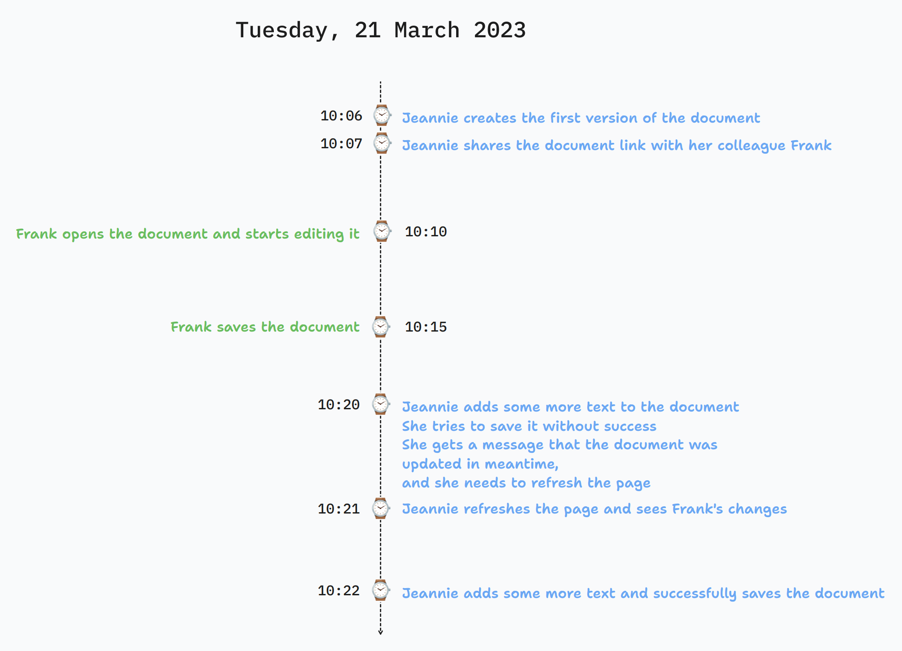
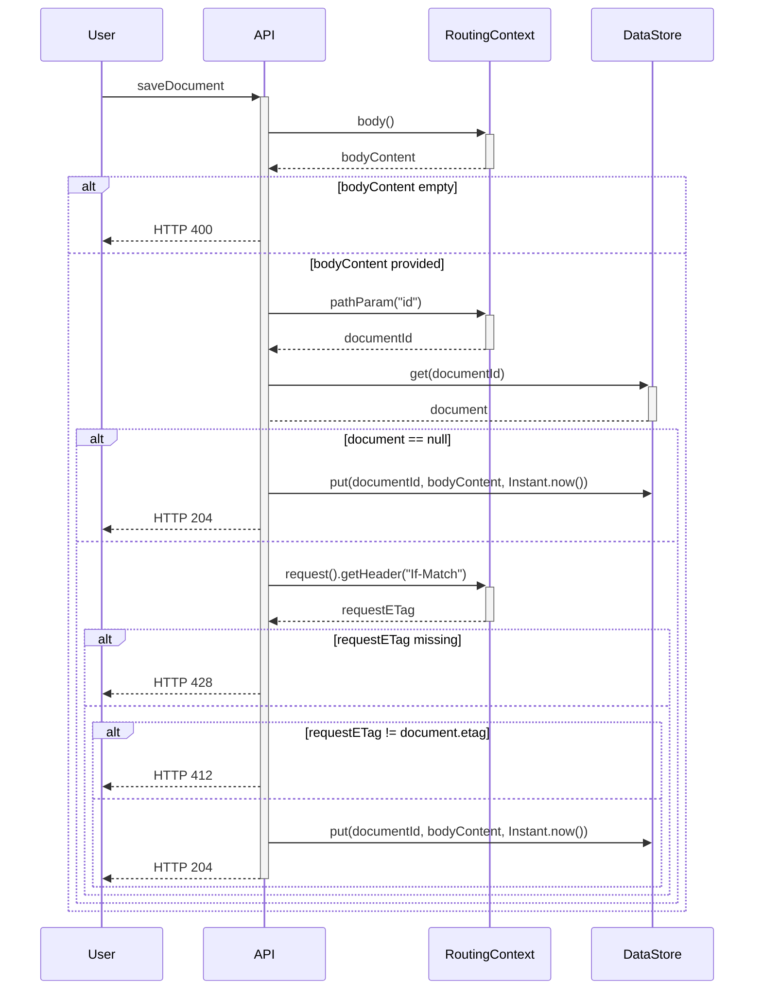
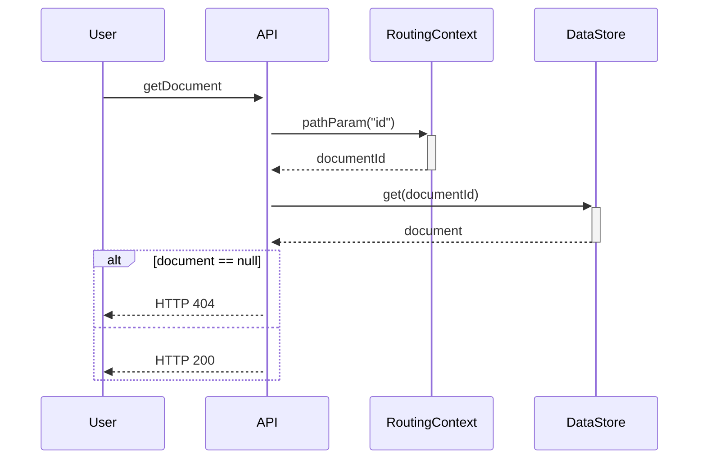

In this article, we will show you how to design and implement a REST API that can handle concurrent requests when updating the same resource.

We also provided [a sample code](#sample-code) which you can use to implement the described solution.

<!--truncate-->

## What's the problem to solve?

The issue we want to tackle can also be described as "lost updates". When do such updates happen? When the same resources are attempted to be updated by multiple clients at the same time.
What happens in such cases, if you don't have any special handling? **The last update wins**.

Depending on the use case, this may or may not be a problem.

In case you want more predictable behavior, so that the end state is not determined by "pure luck", follow the rest of the article, where we describe how you can implement a solution based on ETags[^1].

## What are ETags?

ETag can be described as a fingerprint of a resource. It's a unique identifier that is generated based on the content of the resource. If the content changes, the ETag changes as well.
ETag is used for caching purposes, as well as for concurrency control, which is our use case.

:::tip Weak vs Strong ETags

ETags can be either **strong** or **weak**. Strong ETags guarantee byte-for-byte equality. They are more expensive to generate. Weak ETags only guarantee that the content is semantically equal.

For our use case, we will use weak ETags.
:::

:::info `ETag` vs `Last-Modified`
`Last-Modified` header is another way to handle caching/concurrency. How does it work? When we fetch a resource from the server, we get a `Last-Modified` header in the response. This header contains the **date
and time when the resource was last modified**. When we want to update the resource, we send the `If-Unmodified-Since` header[^2] in the request. The server will check if the resource was modified after the date and
time specified in the header. If it was, the update will be rejected with `412 Precondition Failed` response. If it wasn't, the server will proceed with handling the request.

The issue with this approach is its precision. The `Last-Modified` header is only precise to the second. If the resource is updated multiple times in the same second, the `If-Unmodified-Since` header will not be
able to distinguish between the updates.
:::

## Real-world example

If we have no special handling of concurrent requests, this leads to **"lost updates"** problem. This means that the later request overwrites the changes made by the earlier requests, making them "lost".

Let's demonstrate the problem of lost updates with an example. Let's, for a moment, pretend there's no such thing as Google Docs or similar collaborative editing tools.
Our boss comes to us and says:

> We need a tool that will allow group of people to **work together on a text document**. It needs to be finished in **2 days**.

With all the time in the world, we came up with the following design:

* This **will not be** a real-time collaboration where we can see the changes as they happen
* A user will only be able to update the document if the document is based on the **latest version of the document**

The business was happy with the design proposal, so we started implementing it.

### The user experience

After we finished the implementation, we tested it, by inviting 2 of our colleagues (Jeannie and Frank) to test it out.
The following is a timeline of Jeanie and Frank's actions and the results:

Our boss was fine with the results!

## Design & Implementation

To be able to achieve such user experience, we came up with the following API design:

* We will use **weak ETags** to handle concurrency
* We will need 2 API operations, one to **save** and one to **get** a document

### Saving a document

We designed saving a document so that it will use an idempotent `PUT` HTTP method. This method will be used to create a new document, as well as to update an existing one.
Clients are allowed to set the `documentId`.

The following is a sequence diagram of how the API operation was implemented:

For those of you who prefer it using plain English, here's the description of the sequence diagram:

1. The user sends a `PUT` request to the API
2. The API gets the request body
3. If the request body is empty, the API returns `400 Bad Request`
4. If the request body is not empty, the API gets the `documentId` from the path parameters
5. The API gets the document from the data store
6. If the document is not found, the API creates a new document with the provided `documentId` and `bodyContent`
7. If the document is found, the API gets the `If-Match` header from the request
8. If the `If-Match` header is missing, the API returns `428 Precondition Required`
9. If the `If-Match` header is present, the API compares it with the document's ETag
10. If the ETags don't match, the API returns `412 Precondition Failed`
11. If the ETags match, the API updates the document with the provided `bodyContent`
12. The API returns `204 No Content`

:::tip
Requirements for this sequence are described in the [RFC 7232](https://www.rfc-editor.org/rfc/rfc7232#section-5)
:::

### Getting a document

Getting a document is far simpler. Using standard `GET` HTTP method, we will return the document with the provided `documentId`. If there's no document with the provided `documentId`,
 we will return `404 Not Found`.

The following is a sequence diagram of how the API operation was implemented:

## Sample code

You can find a sample code showing how to implement a concurrent REST API on our [GitHub](https://github.com/gran-software-solutions/code-samples/tree/main/concurrency-in-rest-apis)

## Conclusion

ETags are a great tool when it comes to handling concurrent requests predictably.

[^1]: [ETag](https://developer.mozilla.org/en-US/docs/Web/HTTP/Headers/ETag)
[^2]:  [If-Unmodified-Since](https://developer.mozilla.org/en-US/docs/Web/HTTP/Headers/If-Unmodified-Since)