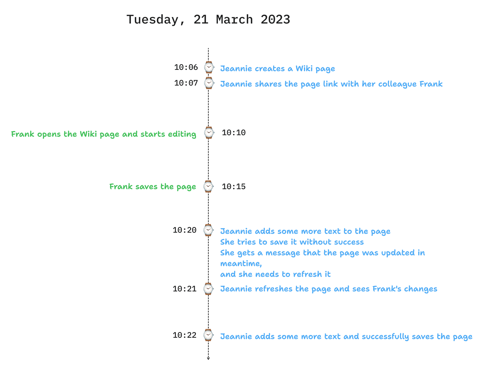

In this article, we will show you how to design and implement a REST API which can handle concurrent requests when updating the same resource.

:::tip
We also provided a sample code ([GitHub Link](https://github.com/gran-software-solutions/code-samples/tree/main/concurrency-in-rest-apis)) which you can use to implement the described solution.
:::

<!--truncate-->

## What's the problem to solve?

The issue we want to tackle can also be described as "lost updates". When do such updates happen? When the same resources is attempted to be updated by multiple clients at the same time.
What happens in such cases, if you don't have any special handling? The last update wins. The first update is lost.

Depending on the use case, this may or may not be a problem.

In case you want more predictable behavior, so that the end state is not determined by "pure luck", follow the rest of the article, where we describe how you can implement a solution based on ETags[^1].

## What are ETags?

ETag can be described as a fingerprint of a resource. It's a unique identifier which is generated based on the content of the resource. If the content changes, the ETag changes as well.
ETag is used for caching purposes, as well as for concurrency control, which is our use case.

:::info `ETag` vs `Last-Modified`
`Last-Modified` header is another way to handle caching/concurrency. How it works? When we fetch a resource from the server, we get a `Last-Modified` header in the response. This header contains the **date
and time when the resource was last modified**. When we want to update the resource, we send the `If-Unmodified-Since` header[^2] in the request. The server will check if the resource was modified after the date and
time specified in the header. If it was, the update will be rejected with `412 Precondition Failed` response. If it wasn't, the server will proceed handling the request.

The issue with this approach is its precision. The `Last-Modified` header is only precise to the second. If the resource is updated multiple times in the same second, the `If-Unmodified-Since` header will not be
able to distinguish between the updates.
:::

## Real world example

Let's demonstrate the problem of lost updates with an example. Let's, for a moment, pretend there's no such thing as Google Docs or similar collaborative editing tools.
Our boss comes to us and says:

> We need a tool which will allow group of people to **work together on a text document**. It needs to be finished in **2 days**.

With all the time in the world, we came up with the following design:

* This **will not be** a real-time collaboration
* A user will only be able to update the document if the document is based on the **latest version of the document**

The business was happy with the design, so we started implementing it.

### The user experience

After we finished the implementation, we tested it, by inviting 2 of our colleagues (Jeannie and Frank) to test it out.
Lets what happened:

Our boss was fine with the results!

## Design & Implementation

TODO

## Code

You can find sample code showing how to implement a concurrent REST API at our [GitHub](https://github.com/gran-software-solutions/code-samples/tree/main/concurrency-in-rest-apis)

## Conclusion

ETags are a great tool when it comes to handling concurrent requests in predictable way.

[^1]:  [ETag](https://developer.mozilla.org/en-US/docs/Web/HTTP/Headers/ETag)
[^2]:  [If-Unmodified-Since](https://developer.mozilla.org/en-US/docs/Web/HTTP/Headers/If-Unmodified-Since)