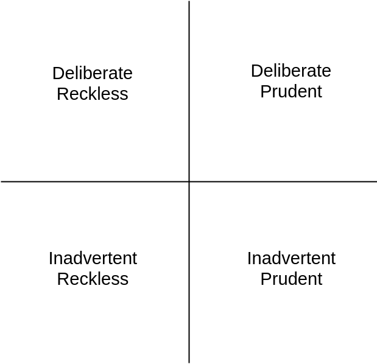

Is there a deliberate understanding of what a “technical debt” is and what it isn’t? In this article we will see how the understanding of technical debt evolved and what it means today to organisations and teams
working with software-intensive projects.

<!--truncate-->

> *“Slow and steady wins the race.”*
>
> — Aesop, ancient storyteller, 600 BCE

## The Original Metaphor
The term was coined in early 1990 by Ward Cunningham[^1]. He first used this term as a financial metaphor for software development. At that time he was working on a financial product and, inspired by George Lakoff[^2],
wanted to reach a common understanding with stakeholders. As he said:

> *“I coined the debt metaphor to explain the refactoring that we were doing in the Y Cash product”*

What is worth noting here is that Cunningham’s metaphor is strictly related to refactoring of code. The reason why would you need to refactor your software, Cunningham explains using following words:

> *“I thought that rushing software out the door, to get some experience with it, was a good idea. But of course, you would eventually go back and as you learn things about that software you would repay that loan by
refactoring the program to reflect your experience as you acquired it”*

The gist of it is that while software is developed with a high uncertainty, you learn as you go and incorporate those learnings into your software by refactoring. Cunningham explains also the consequences of not doing it:

> *“If you develop a program for a long period of time by only adding features and never reorganising it to reflect your understanding of those features then eventually this program does not contain any understanding
and all efforts to work on it take longer and longer, and you will make zero progress”*

In short: not refactoring your code grinds your project to a halt.

Cunningham’s metaphor tells us that:

1. You can create software that you understand only partially - **this is your loan**.
2. Working on a code that does not reflect your current understanding of your problem costs extra time - **this is your interest**.
3. As you learn more about your problems, you ought to refactor your code - **repay your loan**.
4. Otherwise, you make no progress - **or your purchasing power goes to zero**.

Originally, the metaphor is about understanding the software you are working on. Some extended its meaning to include quality issues - hacks and workarounds. But Cunningham was very clear about this:

> *“Bloggers have explained the debt metaphor and confused it with the idea that you could write code poorly with the intention of doing a good job later and thinking that was the primary source of debt. I'm never in favour
of writing code poorly, but I am in favour of writing code to reflect your current understanding of the problem even if that understanding is partial.”*

In other words, **technical debt is not an excuse to produce low quality code**. Technical debt is about producing good quality code without full understanding of the problem. Low quality code can prevent you from paying back
your debt as Cunningham explains:

> *“The ability to pay back debt and make the debt metaphor work for your advantage depends upon you **writing code that is clean enough to be able to refactor it** as you come to understand your problem”*

The original financial metaphor tells us what technical debt is and what it is not:

Technical debt is not:

- Bugs
- Convoluted code
- Unreadable code
- Magic numbers
- Hacks
- Duck tape methods

Technical debt is:

- Solution that seems to be optimal today but may not be optimal tomorrow
- Solution that we hope to be optimal, although we have no possibility to assess it today

If you haven’t yet, you should watch his <u>[video](https://www.youtube.com/embed/pqeJFYwnkjE)</u>

## Uncle Bob’s Take On Technical Debt

You probably have no clue who I am, but you surely know Uncle Bob. He agreed with Cunningham that technical debt does not come from low quality code:

> *“A mess is not a technical debt. A mess is just a mess.”*

Uncle Bob draws a thick line between low quality and a technical debt. He says that a technical debt is a rational but risky decision that can potentially be beneficial in the future:

> *“Technical debt decisions are made based on real project constraints. They are risky, but they can be beneficial. The decision to make a mess is never rational, is always based on laziness and unprofessionalism, and has no chance
of paying off in the future. A mess is always a loss.”*

Mess on the other hand is always a loss. Uncle Bob cannot find an excuse for “quick and dirty” solutions, hacks and workarounds that sometimes are labelled a technical debt. On the contrary. Uncle Bob believes that the more debt you
take on, the more discipline you must exercise in your project:

> *“When you buy a house and take on a big mortgage debt, you tighten up all your spending and accounting. You clean up your books and your budgets. You behave with increased discipline. The same is true of technical debt.”*

Uncle Bob pretty much reiterates Cunningham’s point of view about what technical debt isn’t:

- Bugs
- Convoluted code
- Unreadable code
- Magic numbers
- Hacks
- Duck tape methods

And what technical debt is:
- Solution that seems to be optimal today but may not be optimal tomorrow
- Solution that we hope to be optimal, although we have no possibility to assess it today

As an example, Uncle Bob is using a decision about iframes vs AJAX. On a higher level it could be a scenario where a product team does not take into account internationalisation in their designs but at some point in time the company
introduces their product on a different continent and so an expensive redesign is required.

Read more on <u>[Uncle Bob’s blog](https://sites.google.com/site/unclebobconsultingllc/a-mess-is-not-a-technical-debt)</u>.

# Martin Fowler’s Take On Technical Debt

Martin Fowler is an equally important persona in software engineering that expressed his view on what technical debt is and isn’t. In contrast to Ward Cunningham and Uncle Bob, Martin Fowler found a place for low quality code, and
even ignorance, in technical debt. As he said:

> *“The metaphor of debt is sometimes used to justify neglecting internal quality. The argument is that it takes time and effort to stop cruft from building up.”*

We will discuss shortly what is meant by “cruft”.

Fowler says that technical debt is both deliberate or inadvertent and reckless or prudent. This creates a taxonomy of technical debt:
- Inadvertent Reckless
- Deliberate Reckless
- Deliberate Prudent
- Inadvertent Prudent

With those 4 types of technical debt, the whole field is covered. Meaning, a technical debt can originate from low quality code (reckless) or assumption based decisions (prudent). To draw a more detailed picture, we could describe those
types like so:

**Inadvertent Reckless** - We don’t know how to do it, but we will anyway 
**Deliberate Reckless** - We know how to do it but doing it quick and dirty will maybe save us time 
**Deliberate Prudent** - We know it’s not good, but this is a one time job and so worth it 
**Inadvertent Prudent** - Now we see the difference between our assumptions and real requirements 

Fowler says that debt, in the form of deficiencies in internal quality, will build up and make it harder to modify the system. Those deficiencies are cruft that lives next to essential complexity required to do the job.

Neglecting internal quality may be a good call if managed properly, e.g. to roll out features faster and repay the debt as soon as possible. Unfortunately, more often than not it is mismanaged and, as Fowler puts it:

> *“Cruft has a quick impact, slowing down the very new features that are needed quickly.”*

You can read more about his point of view <u>[here](https://martinfowler.com/bliki/TechnicalDebtQuadrant.html)</u> and <u>[here](https://martinfowler.com/bliki/TechnicalDebt.html)</u>.

# My Take On Technical Debt
The metaphor of technical debt is attracting academic attention. Since 2006, a number of research in this area is growing systematically as you can see in the following table [^3]:

| 2006 | 2010 | 2011 | 2012 | 2013 | 2014 | total* |
|------|------|------|------|------|------|--------|
| 1    | 17   | 24   | 58   | 47   | 61   | 208    |
*as of 2016

After studying a big portion of those papers, the answer is as usual: it depends.

The term itself has no universal definition and its meaning is fluid. From a company to a company, from an individual to an individual. It changes scope, taxonomy and importance. It touches every aspect of software development. From
design and architecture, through infrastructure, tests and bugs up to requirements, processes and even people.

The only thing that matters, though, is **what technical debt means to your team** and organisation. It is of utmost importance to have a deliberate understanding of technical debt within the boundaries of your context - be it a team
or the whole company.
However, you define technical debt, there are a few rules of thumb that every team and organisation should follow:

You must be able to reason about technical debt with developers **and** managers. 
Technical debt must be **discussed openly and transparently**. 
Technical debt must be **documented** along with cost of its existence and cost of potential payoff. 

Increasing visibility of technical debt is the first step of managing it. Just because you don’t manage technical debt, doesn't mean it doesn't exist. It’s always there, incurring costs, causing delays, bugs, incidents and users’
dissatisfaction.

# What You Can Do Today To Manage Technical Debt

Ask your fellow teammates how they **define technical debt**. Collect all definitions, put them on a wall, do a brainstorming session. Ask questions about anything that slows you down:
- Are bugs technical debt?
- Are code smells technical debt?
- Are missing requirements technical debt?

Once you know what to call a technical debt, create a label in your issue tracker or project management system and **start writing tickets for technical debt** and labelling them. Put them in the backlog!

> *“All work is work; all work goes on the backlog.”* [^4]

A good technical debt ticket includes information about: 
**Where is it** - it could be a file, module, piece of architecture or even part of your deployment process 
**Cost of its existence** - what problems does it incur. You cannot really estimate the value of it, but at least try using fibonacci numbers or t-shirt sizes. 
**Cost of repayment** - how much effort would it take to fix it. Again, try abstracting it away. Maybe the same way you do with your tickets (unless you estimate hours, then stop doing it) 

Having a proper ticket helps to reason about when and if to repay a specific debt. And having it in the backlog allows you to **prioritise technical debt**. Every time you decide which tickets to deal with, ask if there are technical
debt tickets related to the specific area of the code you want to work on. E.g. if you are adding a new endpoint to your REST API, ask if there are technical debt issues with the router or input validation. And if so, do them first.

Below you will find an example of a technical debt ticket:

| [TD] Extending router is cumbersome and difficult to test                                                                                                                                                                                                          |
|--------------------------------------------------------------------------------------------------------------------------------------------------------------------------------------------------------------------------------------------------------------------|
| **Where is it**: there are a bunch of files you have to touch when adding a new endpoint. First the router, then you need to extend interfaces and every class that’s implementing it. There’s no proper test for the router, only unit tests for implementations. |
| **Cost of its existence**: I’d say it’s an 8. We are at the stage where a new endpoint is coming up pretty much every sprint, so we constantly add to the complexity. If we don’t fix it soon, it will grow to a 13.                                               |
| **Cost of repayment**: To fix it, we need to reduce the number of interfaces and maybe replace some with a functional approach (lambdas?). With concept and implementation I think it’s a day or two. Or 5 points if you will.                                     |

Yes, I believe estimating time should be avoided. But I am not going to force it on anyone.

And whatever you do, **follow established software engineering practices**. Otherwise, you will accrue reckless and inadvertent technical debt.

[^1]: https://en.wikipedia.org/wiki/Ward_Cunningham
[^2]: https://en.wikipedia.org/wiki/Metaphors_We_Live_By
[^3]: Nicolli S.R. Alves, Thiago S. Mendes, Manoel G. de Mendonça, Rodrigo O. Spínola, Forrest Shull, Carolyn Seaman (2016), “Identification and Management of Technical Debt: A Systematic Mapping Study”
[^4]: Kruchten, Nord (2019), “Managing Technical Debt: Reducing Friction in Software Development” p.191

