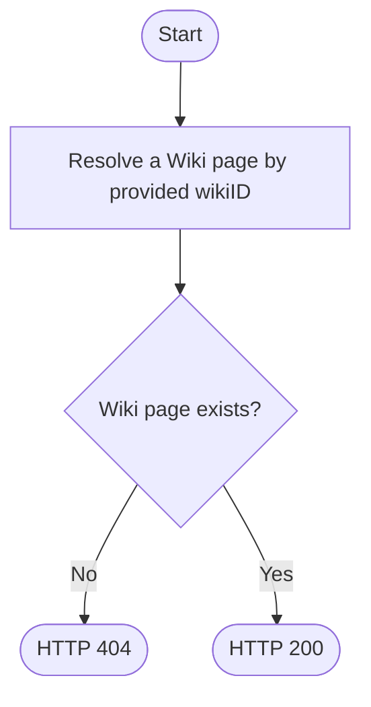

<figure>


<figcaption>
    <center>
        Image by <a href="https://pixabay.com/users/furbymama-5146222/?utm_source=link-attribution&amp;utm_medium=referral&amp;utm_campaign=image&amp;utm_content=5238078">Andy M.</a> from <a href="https://pixabay.com//?utm_source=link-attribution&amp;utm_medium=referral&amp;utm_campaign=image&amp;utm_content=5238078">Pixabay</a>
    </center>
</figcaption>
</figure>

In this article, we will show you how to design and implement a REST API that can handle concurrent requests when updating the same resource.

We also provided <u>[a sample code](#sample-code)</u> that demonstrates how to implement this in a real-world-like scenario of Wiki page
management API.

<!--truncate-->

## What's the problem to solve?

The issue we want to tackle is known as **"lost updates"**. When do such updates happen? When the same resources are attempted to be updated by multiple clients at the same time.
What happens in such cases, if you don't have any special handling? **The last update wins**.

Let's illustrate this with an example of two different users trying to update the same Wiki article:
<br/>


<br/>

The issue with this flow is that the User2 was able to update the document, without even caring if the document might have
changed in the meantime. User1's update **was lost**.

The solution is to make one of the two users (User2 in this case) angry :slightly_smiling_face:.

How's that? Let's read on.

## Optimistic locking - the solution to "lost updates"

You may have noticed that some software you used in the past had a mechanism to prevent "lost updates". Let's take a Wiki as an example.
As a Wiki page is shared among your teammates, and as writing a Wiki page is a collaborative effort, and additionally takes a while to write,
the chances are that someone else may have updated the page as of the time you were writing your changes.

Usually such tools will let you know that you need to sync your changes with the latest version of the page. This may lead to conflicts that
you need to resolve, before saving your work.

You may have expereinced the same by using Git Source Code Versioning tool. If you try to push your changes to a remote repository, and someone
else pushed their changes to the same branch as you, you will get an error message saying that you need to pull the remote changes first.

The beauty of this design is that it forces you to base your work on the work of others, **whether you like it or not**.

The design implemented in both cases is called <u>["optimistic locking"](https://en.wikipedia.org/wiki/Optimistic_concurrency_control)</u>.
Simply put, it's an assumption that the transactions will not interfere often, and that there is no need to lock the resources they may change. Instead,
transactions are allowed to change the data, but before they are committed, there is a check to see if the data has been changed in the meantime. Non
locking approach brings a performance benefit.

Later in this article, we will show an example of the Wiki page management API, and we will use optimistic locking to prevent "lost updates".

Technical means we will use to implement optimistic locking are `ETag` and `If-Match` HTTP headers.

Let's learn first about ETags first.

## What are ETags?

`ETag` (stands for **E**ntity Tag) is an <u>[HTTP response header](https://developer.mozilla.org/en-US/docs/Web/HTTP/Headers/ETag#avoiding_mid-air_collisions)</u>. The value of
this header is an opaque identifier assigned by servers to specific versions of resources. If the content of the resource changes, the ETag changes as well.
ETag is used for caching purposes, as well as for concurrency control. An example of an `ETag` header:

```http
GET /api/v1/documents/123 HTTP/1.1
Host: example.com
Accept: application/json

HTTP/1.1 200 OK
Content-Type: application/json
ETag: "bfc13a64729c4290ef5b2c2730249c88ca92d82d"

{
  "id": 123,
  "title": "My document",
  "content": "This is my document"
}
```
:::tip
There are 2 types of `ETag`s: **weak** and **strong**.
Strong `ETag`s imply byte-by-byte equality. Weak `ETag`s imply semantic equality.

Technically, weak `ETag`s are prefixed with `W/`. Strong `ETag`s are not prefixed.

An example of a weak `ETag` would be `W/"bakck3"`, whereas an example of a strong `ETag` would be `"bfc13a64729c4290ef5b2c2730249c88ca92d82d"`.

Strong `ETag`s are usually preferred, as they are more reliable. However, they are more expensive to compute
As strong `ETag`s are preferred by `If-Match` header, we will use them in our example.

Read more about `ETag`s in [MDN Web Docs](https://developer.mozilla.org/en-US/docs/Web/HTTP/Headers/ETag).
:::

## Control concurrency with `If-Match` HTTP request header

`If-Match` <u>[request header](https://developer.mozilla.org/en-US/docs/Web/HTTP/Headers/If-Match)</u> makes the request conditional.
`If-Match` contains list of `ETag`s. The flow works like this:
1. A user requests a resource from the server, and the server responds with the resource and its `ETag`.
2. User makes local modification to the resource
3. User sends the modified resource to the server, along with the `ETag` of the resource it received from the server. This `ETag` is sent in
`If-Match` header.
4. Server checks if the `ETag` in `If-Match` header matches the `ETag` of the resource on the server. If they match, the server proceeds with
handling the request.
5. If the `ETag`s don't match, the server responds with `412 Precondition Failed` response.

Let's illustrate this with an example based on our Wiki page management API:
<br/>


## Real-world example

As mentioned earlier, we designed the Wiki page management API. It provides the following user experience:


## Design & Implementation

To be able to achieve such a user experience, we came up with the following API design:

* We will need 2 API operations, one to **save** and one to **get** a Wiki page
* We will use **strong ETags** and **If-Match** HTTP headers

### Saving a Wiki page

We designed saving a Wiki page so that it will use an idempotent `PUT` HTTP method. This method will be used to create a new document,
as well as to update an existing one. Clients are allowed to set the `id` of a Wiki page.

The following is a flowchart of how the API operation was implemented:


:::tip
The algorithm above strictly follows the [RFC 7232](https://www.rfc-editor.org/rfc/rfc7232#section-5) specification.
:::

### Getting a Wiki page

Getting a Wiki page is far simpler. Using standard `GET` HTTP method, we will return the Wiki page with the provided `wikiId`.
If there's no such page with the provided `wikiId`, we will return `404 Not Found`.

The following is a flowchart of how the API operation was implemented:



## Sample code

On our GitHub, we've published <u>[a sample project](https://github.com/gran-software-solutions/code-samples/tree/main/concurrency-in-rest-apis)</u> that implements the described API.
The sample code is written in <u>[Kotlin](https://kotlinlang.org/)</u> using <u>[Vert.x](https://vertx.io/)</u> toolkit. It requires having <u>[JDK 11](https://adoptopenjdk.net/)</u> or newer installed

The code contains a README file, with instructions on how to <u>[run the app](https://github.com/gran-software-solutions/code-samples/tree/main/concurrency-in-rest-apis#running-application)</u> and how to <u>[interact with it](https://github.com/gran-software-solutions/code-samples/tree/main/concurrency-in-rest-apis#how-to-interact-with-the-running-application)</u>

## What now?

Are there use-cases where your API consumers can manage the same resource? To avoid data loss, use optimistic locking.