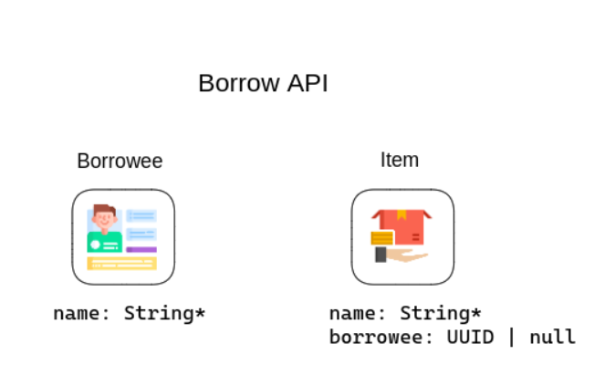
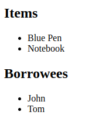

RESTful API without HATEOAS is not a RESTful API by definition. Majority of developers refrain from using HATEOAS because it comes with extra complexity, its value is questionable and it’s not really popular in general.

Let’s explore HATEOAS hands-on and see if those concerns hold true. You will learn how to implement HATEOAS on the server side and on the client side using libraries and get access to working code on Github.

<!--truncate-->

## Introduction

While the RESTfulness of an API falls on a spectrum, incorporating HATEOAS brings it closer to the ideal. By adopting HATEOAS principles, you can achieve better coordination, simplify development, and enhance the overall collaborative experience.

If you want to have:
- a robust API by making your clients harder to break
- self-documenting endpoints that improve communication
- a standard convention to leverage rich tooling and libraries

Read further and see what I propose to solve the HATEOAS complexity problem.


## HATEOAS in Backend
In our example we will use Kotlin and Spring, because I think this is a pretty popular and easy to use setup.

I would suggest you start with designing the API first. For our example we will use OpenAPI 3.0 specification.


We’re going to create a Borrow API to manage things that you lend, so that you will never lose a thing! We’re going to have a Borrowee (because it sounds nice) and an Item. We could have many endpoints to cover many use cases like so:

```
GET /items
GET /items/{name}
GET /borrowees
GET /borrowees/{name}
POST /item
POST /borrowee
PUT /item/{name}
DELETE /item/{name}
DELETE /borrowee/{name}
GET /items/by/{name}
```

But for sake of simplicity we will use only a few, just enough to explain the issue.
You can find the full OAS 3.0 specs in the repository (look in the comment section down below) in `resources/borrow.yaml`.
OpenAPI specs is the place where you already need to think about HATEOAS. A good idea is to sketch first what links you want to attach where. And don’t forget to leverage JSON Schema i.e. define links in components, not in paths.

## OpenAPI

The Borrow API has only two objects (Item, Borrowee) and we could define them like so:

```yaml
components:
  schemas:
    Item:
      type: object
      properties:
        name:
          type: string
        borrowee:
          type: string
        links:
          type: object
          properties:
            self:
              $ref: '#/components/links/item-from-name'
            borrowee:
              $ref: '#/components/links/borrowee-from-item'
    Borrowee:
      type: object
      properties:
        name:
          type: string
        links:
          type: object
          properties:
            self:
              $ref: '#/components/links/borrowee-from-name'
            items:
              $ref: '#/components/links/item-from-borrowee'
```

You can see that there is the property `links` which defines two other properties. The `self` and the `borrowee` for Item and `self` and `items` for Borrowee. All of those refer a component from the JSON Schema (`$ref: …`):

```yaml
  links:
    borrowee-from-item:
      operationId: get-a-borrowee
      parameters:
        name: $response.body#/borrowee
    borrowee-from-name:
      operationId: get-all-borrowees
      parameters:
        name: $response.body#/name
    item-from-name:
      operationId: get-an-item
      parameters:
        name: $response.body#/name
    item-from-borrowee:
      operationId: get-items-by-borrowee
      parameters:
        name: $response.body#/name
```

Let’s decode this part. A link is made of 3 parts:
- Name
- Operation id
- Parameters

Take the first one as an example. `borrowee-from-item`” is the name of the link. It refers the operation with the id `get-a-borrowee`. This operation id is a concrete path from the specification. In our case it’s this:

```yaml
  '/borrowee/{name}':
    get:
      operationId: get-a-borrowee
      responses:
        '200':
          description: OK
          content:
            application/json:
              schema:
                $ref: '#/components/schemas/Borrowee'
              examples:
                Example 1:
                  value:
                    name: John
                    links:
                      self: /borrowee/John
                      items: /items/by/John
```

Last but not least, the list of parameters that are used to build the URI e.g. when you have path parameters in your endpoint. Our URI is `/borrowee/{name}`. So the link has a `name` parameter defined. Its value comes from the body of the response. If the response looks like so:

```json
{
	"name": "blue pen",
	"borrowee": "john"
}
```

You can address this property using this syntax: `$response.body#/borrowee`.
This may sound confusing by now. But it’s pretty simple if you approach this in 4 steps:
- Define your components in schema
- Define your paths and which components they return
- Define self links for every component
- Define which components should be linked in other components

Now that you have your OpenAPI specs, you have two options. Generate code from it (e.g. models or even interfaces for your controllers) or write your code based on the specifications. This is an article about HATEOAS and not OpenAPI code generation, so let’s just write some code.

# Kotlin

We will need two models:

```kotlin
data class Item(val name: String, val borrowee: String) : RepresentationModel<Item>()
data class Borrowee(val name: String) : RepresentationModel<Borrowee>()
```

Those will extend the `org.springframework.hateoas.RepresentationModel`. To use it, you can include this starter in your `build.gradle`:
```kotlin
implementation("org.springframework.boot:spring-boot-starter-hateoas")
```

Now create two controllers. `ItemController` and `BorroweeController`. Let’s first add an endpoint returning all items.

```kotlin
    @GetMapping("/items")
    fun getItems(
        @RequestParam(value = "page", defaultValue = "0") page: Int = 0,
        @RequestParam(value = "size", defaultValue = "2") size: Int = 2,
    ): ResponseEntity<CustomCollectionModel<Item>> {
        val items = listOf(
            Item("Blue Pen", "John").apply {
                add(linkTo(methodOn(ItemController::class.java).getItem(this.name)).withSelfRel())
                add(linkTo(methodOn(BorroweeController::class.java).getBorrowee(this.borrowee)).withRel("borrowee"))
            },
            Item("Notebook", "John").apply {
                add(linkTo(methodOn(ItemController::class.java).getItem(this.name)).withSelfRel())
                add(linkTo(methodOn(BorroweeController::class.java).getBorrowee(this.borrowee)).withRel("borrowee"))
            },
            Item("Headphones", "John").apply {
                add(linkTo(methodOn(ItemController::class.java).getItem(this.name)).withSelfRel())
                add(linkTo(methodOn(BorroweeController::class.java).getBorrowee(this.borrowee)).withRel("borrowee"))
            }
        )

        val pageable = PageRequest.of(page, size)
        val startIndex = pageable.offset.toInt()
        val endIndex = min(startIndex + pageable.pageSize, items.size)
        val selected = items.subList(startIndex, endIndex)

        val totalPages = ceil(items.size.toDouble() / size).toInt()

        return ResponseEntity.ok(
            CustomCollectionModel(selected).apply {
                add(linkTo(methodOn(ItemController::class.java).getItems(page, size)).withSelfRel())

                if (page > 0) {
                    add(linkTo(methodOn(ItemController::class.java).getItems(0, size)).withRel("first"))
                    add(linkTo(methodOn(ItemController::class.java).getItems(page - 1, size)).withRel("prev"))
                }

                if (page < totalPages - 1) {
                    add(linkTo(methodOn(ItemController::class.java).getItems(page + 1, size)).withRel("next"))
                    add(linkTo(methodOn(ItemController::class.java).getItems(totalPages - 1, size)).withRel("last"))
                }
            }
        )
    }
```

We use RequestParams for page and size. This is used for pagination. In the bottom of the function you can see how we leverage HATEOAS to provide clients with automated pagination:

```kotlin
        return ResponseEntity.ok(
            CustomCollectionModel(selected).apply {
                add(linkTo(methodOn(ItemController::class.java).getItems(page, size)).withSelfRel())

                if (page > 0) {
                    add(linkTo(methodOn(ItemController::class.java).getItems(0, size)).withRel("first"))
                    add(linkTo(methodOn(ItemController::class.java).getItems(page - 1, size)).withRel("prev"))
                }

                if (page < totalPages - 1) {
                    add(linkTo(methodOn(ItemController::class.java).getItems(page + 1, size)).withRel("next"))
                    add(linkTo(methodOn(ItemController::class.java).getItems(totalPages - 1, size)).withRel("last"))
                }
            }
        )
```

The CustomCollectionModel is a wrapper around the response. This has two important tasks:
- Allow for adding extra fields to the model (this is used to add links)
- Allow us to define the response as we wish. In our case we want to have something like:

```json
{
	"data": []
	"_links": {}
}
```

Without this wrapper we would not be able to add `_links`, and without our custom wrapper instead of `data` we would see the `_embedded` property.
The first few lines of code that define the `items` variable is just a database replacement. But it does show HATEOAS in action:

```kotlin
Item("Blue Pen", "John").apply {
    add(linkTo(methodOn(ItemController::class.java).getItem(this.name)).withSelfRel())
    add(linkTo(methodOn(BorroweeController::class.java).getBorrowee(this.borrowee)).withRel("borrowee"))
}
```
Because our model extends the `RepresentationModel`, we can add extra properties i.e. links. Those are generated from the controller and allow us to define the `rel` name. The code from above would generate something similar to:
```json
{
  "name": "Blue Pen",
  "borrowee": "John",
  "_links": {
    "self": "/item/Blue Pen",
    "borrowee": "/borrowee/John"
  }
}
```
We will do the same for BorroweeController. But to allow clients to discover the API entirely, we need a main hub with all the endpoints that client can access. Let’s create a HATEOASController:

```kotlin
@RestController
@CrossOrigin(origins =  ["http://localhost:3000"] )
class HATEOASController {
    @GetMapping("/")
    fun getItem(): RepresentationModel<*> {
        return RepresentationModel.of(String).apply {
            add(linkTo(methodOn(ItemController::class.java).getItems()).withRel("items"))
            add(linkTo(methodOn(BorroweeController::class.java).getBorrowees()).withRel("borrowees"))
        }
    }
}
```

Great! If you check out the code, you can simply run the app and call those endpoints from the browser or your favourite rest client like Postman or Insomnia.

# HATEOAS on Client Side

For the client we will write a simple React app that uses Axiom to read from our API.
Simply create a new React app and add your component.

```typescript

export default function Index() {
    const [data, setData] = useState<Data>({ items: [], borrowees: [] });

    useEffect(() => {
        fetchData();
    }, []);

    const fetchData = async () => {
        try {
            const loadedData = await loader();
            setData(loadedData);
            console.log(loadedData);
        } catch (error) {
            console.error("Error fetching data:", error);
        }
    };

    return (
        <div>
            <h2>Items</h2>
            <ul>
                {data.items.map((item, index) => (
                    <li key={index}>{item.name}</li>
                ))}
            </ul>

            <h2>Borrowees</h2>
            <ul>
                {data.borrowees.map((borrowee, index) => (
                    <li key={index}>{borrowee.name}</li>
                ))}
            </ul>
        </div>
    );
}
```

The interesting part is inside the `loader()` function:
```typescript
export async function loader(): Promise<Data> {
    const response: AxiosResponse = await axios.get('http://localhost:8080');

    const itemsResponse: AxiosResponse<{ data: Item[] }> = await axios.get(response.data._links.items.href);
    const borroweesResponse: AxiosResponse<{ data: Item[] }> = await axios.get(response.data._links.borrowees.href);

    const items: Item[] = itemsResponse.data.data;
    const borrowees: Item[] = borroweesResponse.data.data;

    return {
        items,
        borrowees
    };
}
```

s you can see, it only requires the base URL i.e. `localhost:8080`. Every other endpoint is discovered automatically. You only need to call it once to see which resources you want to get.
The result is this:



We got all items and borrowees, without even knowing what endpoints we use!

# Conclusion

As you can see, HATEOAS is not a scary monster from under the bed. With proper tooling it’s a breeze to configure and use.
What are your thoughts on HATEOAS? Please let me know and if you think someone could benefit from it, I will be grateful if you share this article.