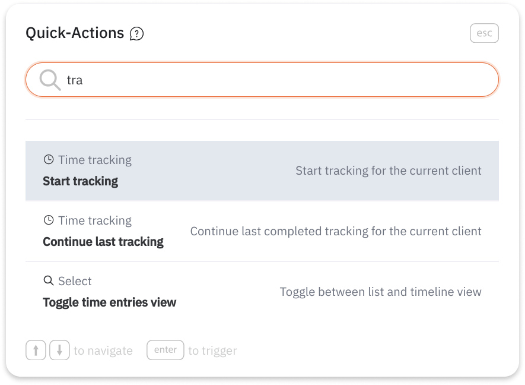
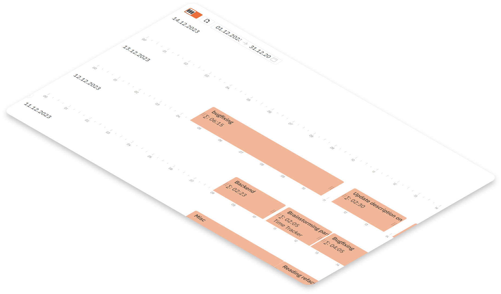
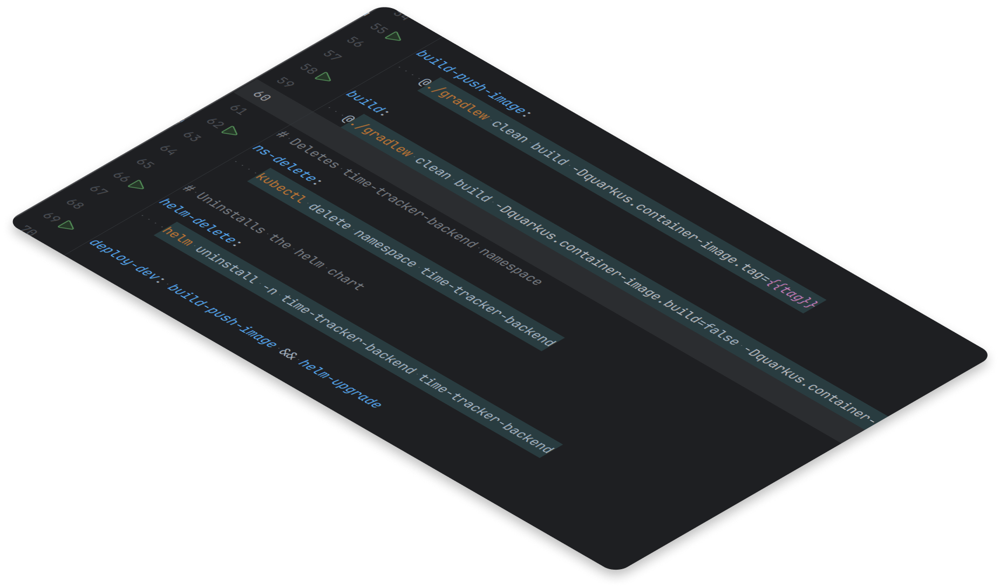

In the world of tools for managing projects, simple options often get lost among complicated ones. Greg, a co-founder of mine, and I wanted something different—easy to use, controlled by the keyboard,
and showing things visually.

That’s how we got the idea for <u>[Timeline](https://timeline.gransoftware.de/)</u>, a simple tool to track time. We wanted it to have lots of shortcuts, quick actions, and show time on a clear visual line.

Developers should like it. We made it for ourselves, but we also wanted to share it with everyone.

<!--truncate-->

## Starting with Ideas: Using Figma for Plans

To make our idea real, we used Figma to draw and plan. It was easy to learn, and we could change things quickly. This helped us make a plan for the basic version of our tool, which we call the 'Minimum Viable Product' (MVP). We picked only the most important features we needed to start using Timeline for our client projects. We wanted it to be easy for everyone to use.

## Visualising Time: How We Made the Timeline

Greg came up early with the idea of using a timeline to show and manage time entries. The idea was to enable resizing, as well as dragging and dropping time entries on the timeline. This provides a simple
overview of the time spent, day by day, and makes it easy to adjust time entries time windows.

## How We Worked Together in a micro-team

We got to work building Timeline fast. Just two of us were on the team, and we skipped a lot of formal meetings. Instead, we worked together a lot, writing code side by side. This made us go faster, and in under two months, we finished building and started using 'Timeline.'

We also found a smart way to put Timeline on the internet without spending too much money. We used a Contabo Virtual Machine that costs only 5 euros each month. We used a tool called Ansible to help us put Timeline online. This made it cheap and easy.

## How Skipping Tests Helped Us Move Faster

We decided to skip writing tests for our product because we wanted to move fast and not worry about maintaining the tests. We thought that testing would slow us down and distract us from building the features
 that our customers wanted. We figured that we could always fix the bugs later, or that our users would report them to us if they found any. So - at the moment - we don't have any automated tests.

## Keeping Things Safe and Technical Details

We cared a lot about keeping Timeline safe. We use <u>[JWT](https://jwt.io/)</u> to protect our backend API. We also made it possible for people to log in without a password. They get a short-living code in their email,
which they can use to sign in.

We use Kubernetes, namely <u>[k3s](https://k3s.io/)</u> - a lightweight distribution, which makes it easy to deploy and manage. We use Helm charts to deploy our frontend. We use <u>[Quarkus Kubernetes](https://quarkus.io/guides/deploying-to-kubernetes)</u> extension
to deploy our backend. Postgres is our database of choice.

These things make sure Timeline works well when we put it online.

## Talking to Everyone: We Need Your Help

Now that Timeline is out, we want to talk to everyone. We need your thoughts. We want people to use Timeline early and tell us what they think. Timeline has lots of cool things, like shortcuts
and a way to change time easily. Right now, we are focused on providing a desktop web experience, with mobile coming later.

Timeline is more than just a tool—it shows how much we care about making things simple and useful for everyone. Join us as we make better tools for tracking time.

We'll share updates soon! Please talk to us and share your ideas too!

Tracking time should be easy, right?
