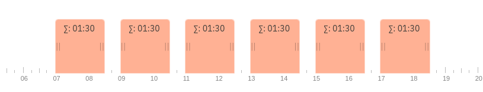
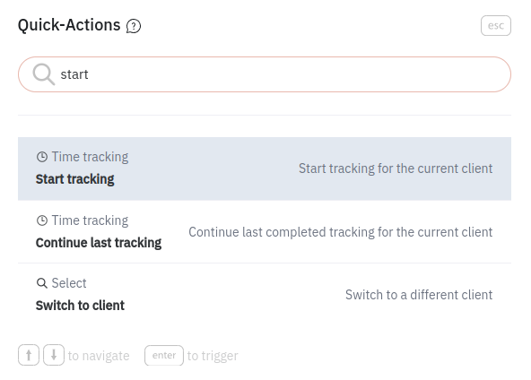

I’m a software developer and a freelancer. Tracking time is something I’m doing every day.

<!--truncate-->

Exporting timesheets and adjusting them when clients argue. Cross-checking tracked time with tickets and contracts (did I overshoot my hours?).
Converting time to decimal values for my invoices (btw. It’s hours + minutes / 60).

```
10:33 = 10 + (33 / 60) = 10.55
```
It may not be much but enough for me to be annoyed with the tools I used to use.

## The Urge to Create
At one point I said to myself: I’m a software developer, I develop software. And so I asked my friend to team up and build our own tool to track time. We wanted to implement all the features we expected, all the quality of life improvements we wanted and craft it so to call it truly ours.

Fast forward **6 weeks** and the tool is online (you can check it out here: https://timeline.gransoftware.de). From the idea to actually using it at our work.

Building your own stuff is really satisfying. The feeling of freedom, the power to create, making something out of nothing. The satisfaction pouring from the process of creation is almost addicting.

Honestly, this is the first reason we even started. We **wanted** to create something. And if you haven’t yet, I really recommend you to start with anything and just create. The feeling of accomplishment will sooth all the stress, despair and sleepless nights.

<video autoPlay loop>
    <source src="/vid1.mp4"/>
</video>

We are happy with what we have so far and time tracking is now fun

### YAGNI
As a software dev, I know very well the “You aren’t gonna need it” principle ([Wikipedia](https://en.wikipedia.org/wiki/You_aren%27t_gonna_need_it)). The issue I had with my old time trackers is that they included everything. The ever growing feature list was overwhelming and those that I really needed were hidden in a swamp of buttons, menus, tabs and options. More often than not I didn’t even know that they support what I wanted just because there was no way to figure this out.



Modern UI and UX teach us that you access the information you are looking for almost instantly. Just double press shift in Intellij, command + space on mac or ctrl + k on any modern website and you'll find anything you need. Two things I expect from any software is to provide:
- Only what is needed
- Fast

And that was a strong motivation for us. To make time tracking simple and fast.

## TL;DR

The inner pressure to consume less and create more, an offer of much more than you actually need, a workflow that’s not aligned with the way you work. These are strong signals that you maybe should not ignore but use them to bring value to this world.

Thanks for reading.

Cheers!