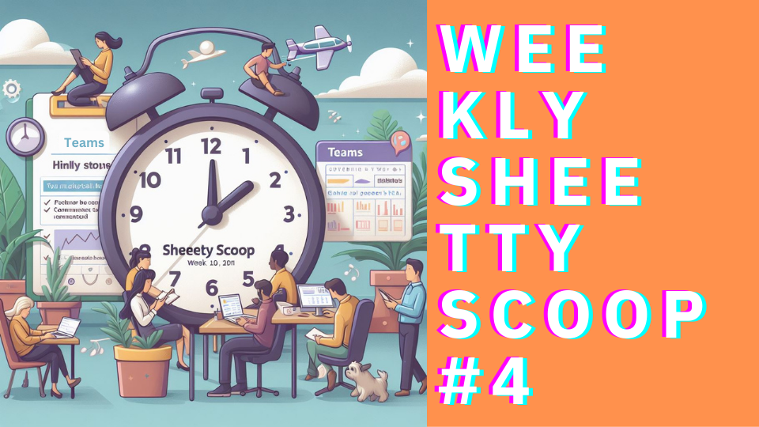

import MyImg from '@site/src/components/MyImg';

This week is a bit less technical. Building a product does not mean programming 20h a day. There are a lot of activities not related to tech. One of those is giving people a chance to get to know you better.

That’s a difficult topic to talk about, so I’m glad you’re here 🙏

<!--truncate-->

## Teams
Traditionally, let’s start with teams, though.

Read-only mode was trickier than initially planned. We’ve implemented a nice loop-hole where one could circumvent the subscription using Teams:
1. Create a team
2. Add yourself
3. Track time even if your sub is expired

Silly little thing, but got finally fixed. It’s still not perfect, but I just want this thing out the door.

<MyImg src={require("./image2.png").default} alt="Testing code in production meme"
       title="Just get this thing out the door."/>

No QoL this week and there are a bunch of Lil’Bugs rapping all around the place. We gotta catch’em all, but later.

TEAMS ARE LIVE

Thaaas Rite. A trial subscription is a minimum requirement to get 3 slots for your organisation which means you can work together with two of your friends.

## What’s Next?
here are a handful of options how to continue:
1. Implement buying more member-slots for your organisation
2. Adding and improving statistics for you and your organisation
3. Add permissions allowing members to see reports etc.

Without the **first**, the feature feels incomplete and may discourage some from using it (e.g. there are 3 free slots, but I have 5 peeps in the team).

Without the **second**, well, I don’t know how my organisation is performing.

Without the **third**, only the owner can export timesheets for the organisation.

With time we’ll implement all of them, but now we need to decide on priority. And since we’re building this tool mainly for us - we shall go with the permissions first.

What we like to think is: **If this tool works for us, it will work for others too**.

And this kind of leads us to the meritum.

## How To Increase Website Traffic?
We are a pretty obscure company.
<MyImg src={require("./image1.png").default} alt="A diagram showing very little visits" title=""/>

Our tool doesn’t get much love currently. And people deserve to know about Consulting Cockpit, so they have more options, so they can make a judgement for themselves whether they like it or not.

And, of course, help us develop it further.

### What’s Our Current Strategy?

Welp, this blog, for once. Some LinkedIn postings every now and then. We do have an [Instagram](https://www.instagram.com/gran_consultingcockpit), although not much is happening there at the moment.

Effects of this strategy are very limited. The theory we want to test is: people don’t know us and are not interested in our content.

### What Do We Want To Achieve?
If we get:
- more people to know us a little better,
- more opportunities to get feedback and improve.

Then it’s a success.

For a better measurability, we aim to have a stable 100 visits a week. The dilemma we have now is to understand which website we really want to promote?

The homepage, the blog or the landing page?

If you want to know more about us:
the homepage will tell you **who we are and what we do**,
the blog will tell you **how we work and what are our values**,
the landing page will give you an opportunity to **see and touch the fruits of our labour**.

All of these are very helpful in building your idea of who we are and if you like us. But promoting all three may lead to lack of focus and in the end, not reaching the goal of 100 visits a week.

And since the homepage gives the fullest image of us, that’s what we are going with. Promoting our homepage https://gransoftware.de

### What will we do?
PAID ADS!

No, not really. We want genuine interest and attention and not to bullshit anyone.

And this means to share, help and give **value**. This mythical value that all social selling experts keep talking about.

### How To Give Value On The Internet?
Our new strategy involves two platforms: Quora and Reddit. The idea is that there are lots of people with problems and questions. And this makes these two platforms the perfect spot to give to the people.

**An answer a day**. That’s the plan. And if our efforts are valuable, someone will eventually click our bio and maybe even link out to our page. That’s the theory at least.

<MyImg src={require("./image3.png").default} alt="A diagram showing very little visits" title=""/>

That’s it for this week’s Weekly Consulting Cockpit Scoop. Thanks for reading!

But don’t just read. Try it out now. It only takes 1 minute: [consultingcockpit.com](https://consultingcockpit.com)
And with a 90 day trial, you can’t go wrong.

